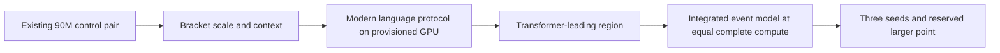

# Main objective: language advantage where Transformers lead

**Latest user direction — CPU-only, tokenized language, reuse public baselines (5 October):** [OPEN_LANGUAGE_REFERENCE_PLAN.md](OPEN_LANGUAGE_REFERENCE_PLAN.md) supersedes new discretionary baseline grids and GPU provisioning requirements below. Reuse published Transformer runs/checkpoints and their exact data/tokenizer; train our integrated models. Start from the smallest credible published Transformer-leading tokenized regime, not a new LSTM crossover campaign. Measure native tokenized CPU throughput and output-head cost before admitting a long fit. Existing jobs/results remain preserved.

**Protocol correction — 5 October 2026, user-directed:** FIFO is an **oracle-assisted diagnostic**, not an eligible reference for anonymous-process learning. `deinterleave_baseline.learn_route()` uses hidden TRAIN item identities to recover the route. The v2 timing-aware probe additionally fits transition-gap statistics with those identities. Neither receives test identities for prediction, but both receive privileged training structure unavailable to native and generic controls. Their scores are retained as oracle-assisted diagnostic targets; exclude them from strongest-reference selection and win/loss verdicts. Native's completed single-seed win against the six generic controls stands: **0.600 vs 0.559 AUROC at N=256**. A fair structure-learning reference must fit exclusively on the same anonymous training logs. Historical contrary interpretations below are superseded by this correction; numerical records remain preserved.

5 October 2026 · User-directed research priority · Prepared, not demonstrated.

Our principal contest is against strong Transformers on larger, representative
language data at equal complete fitting compute. Count models and LSTMs remain
useful controls and diagnostics. Beating them on small text8 is not a prerequisite
for moving to that contest. Finish existing near-complete comparisons, retain
their results, and direct new scaling work toward this objective.

Small tasks can favor simple models because the useful dependency structure is
local or fits a compact state. More experimentation at those scales may also
have produced strong recipes. Neither explanation establishes a mathematical
optimum. Larger scales offer an important architectural opportunity, but also
stronger incumbents and higher experimental cost. We must measure our scaling
behavior rather than infer it from a small-model ranking.

## The comparison we need

For family A, compute cap C, available training corpus D and declared evaluation
context T, define the ideal best achievable loss as

\[
 L_A^*(C;D,T)=\inf_{b:\ C_{\rm fit}(b)\le C} L_A(b;D,T).
\]

The configuration b includes capacity, active work, data presentations and the
training recipe. Our experiment estimates this envelope over a finite,
predeclared search with equal tuning opportunity; it does not solve the infimum.
Use validation to select configurations and an untouched confirmation set to
estimate their quality. Keep research/tuning cost separate from final-fit cost.

The target region has both comparisons:

\[
 L_{\rm Transformer}^* < L_{\rm LSTM}^*,\qquad
 L_{\rm event}^* < L_{\rm Transformer}^*.
\]

Require declared practical margins and uncertainty in the measured versions of
these inequalities. Match the corpus, causal observations, tokenizer, scored
positions and evaluation context. Equal compute means a common cap with charged
forward, backward, route credit and optimizer work; identical parameter counts
or pass counts are not required. Report actual work and unused budget for each
selected model. An inference claim uses a separately declared inference cap.

There is no universal crossover parameter count. Data diversity, tokenization,
context, optimization and capacity/data allocation can move it. A Transformer
lead on a supplied synthetic retrieval task does not locate the language
crossover. LSTMs help map the region; further LSTM tuning does not become an
endless gate that prevents testing a competent modern Transformer.

## What the existing points establish

All costs below are **whole fitting PFLOPs**, not per-target work. Scores are
historical test BPC; the arms were selected on validation. These are exploratory
character-language points, not frontier results or a confirmed crossover.

| Data / common cap | Tuned Transformer | Tuned LSTM | Event model | Interpretation |
| --- | --- | --- | --- | --- |
| 10M / B, 0.1072 PF | 2.215 at 0.103 PF | 1.915 at 0.106 PF | 1.955 at 0.107 PF | LSTM leads; a native lead over this Transformer is outside our main target region |
| 10M / A, 0.3521 PF | 1.996 at 0.347 PF | 1.826 at 0.324 PF | 1.888 at 0.352 PF | LSTM leads; repeated small-scale tuning has lower strategic priority |
| 90M / C, 0.96 PF for references | Pending: 192-wide, four-layer, 0.8 passes | Pending: 512-wide, 1.4 passes | 1.800 at 0.965 PF | Complete the existing control pair; native is slightly above this nominal cap |
| 90M / D, 2.1 PF provisional | Two queued arms | No D-specific LSTM arm | p96 four-pass pending | Reuse any eligible completed C LSTM as a lower-budget anchor; a D-optimized recurrent arm is still needed to estimate the family envelope |

Sources: [tuned reference definitions/results](TUNED_BASELINES.md) and
[native 90M program](AWS_NATIVE_LANGUAGE_90M.md). LSTM windowed validation
rescoring repairs selection; aligned held-out scoring is still required for
identical-context claims. Preserve original carried-state scores beside the
rescored ones. The saved 90M Transformer 1.604 at about 8 PF versus LSTM 1.661
at about 3.9 PF is not an equal-compute crossover demonstration.

## Bounded execution sequence

1. **Reuse the 90M C pair and D Transformer queues.** Preserve the ongoing native
   p96 fit. Record validation trajectories, selected quality, full fitting work
   and score versus context position. Do not add a large CPU grid. At D, consider
   one recurrent size/data allocation chosen from the C trajectory, with a
   bounded learning-rate check and an actual budget audit. Prepare fresh owner
   queues only after C results and physical capacity are inspected.
2. **Bracket adaptively.** At fixed corpus/context, increase the common budget
   geometrically within the provisioned envelope, keeping two plausible
   capacity/data allocations per family and the same tuning allowance. If the
   observed ranking switches, refine that interval once. If data or context
   changes, start a separately labelled bracket; do not join it into a single
   fixed-protocol crossover curve. Do not force a switch by weakening the LSTM.
3. **Move the primary study to modern language data and GPU execution.** Follow
   [FRONTIER_COMPUTE_PROTOCOL.md](FRONTIER_COMPUTE_PROTOCOL.md): immutable
   document splits, shared train-only tokenizer, competent pre-norm/RoPE/gated
   Transformer, optimized attention and equal tuning. Provisioning, corpus and
   native execution contracts are required before numerical admission. Lack of
   a crossover on 27-symbol text8 does not justify indefinitely repeating text8.
4. **Measure context, not just width.** Begin with a feasible shared token
   context, then test one longer context within a newly audited budget. Record
   early/middle/late-position losses and whole-document quality. An event-state
   persistence comparison must give controls the same available causal history,
   or be reported separately. Longer context is a hypothesis, not a promised win.
5. **Test the integrated model inside the measured Transformer-leading region.**
   Select one event recipe on development data and cap its complete fit at the
   reference budget. Confirm selected comparisons with at least three training
   seeds and paired document uncertainty. Reserve one larger-budget point
   before selection; test whether the improvement survives there. A confirmed
   local crossover remains distinct from frontier-scale superiority.

Only the physical owners admit one-job queues through run_safe.sh after checking
current reservations, memory and GPU occupancy. AWS keeps its authorized three
bounded one-thread CPU slots; GPU training stays serial. This review workspace
has no physical-host reservation or ML runtime. The sequence is prepared, not
running here.

## The scaling mechanism to test

The proposed opportunity is useful memory and representational capacity growing
faster than active computation. Retain computational delays/races, sparse
addressed updates, separate keys/values, deep event representations and
counterfactual route credit. Candidate discovery, losing-value teaching and
optimizer work remain charged. Dense or synchronous modules may be diagnostic
controls or declared supports, but their quality cannot stand in for the sparse
temporal mechanism.

For larger banks, measure useful slot exposure, specialization, retrieval recall
and downstream loss at controlled active writes/deliveries. For deeper models,
measure route survival, gradient support and marginal quality per full fitting
work. If counterfactual credit or key scanning grows with every dormant unit,
fixed selected activity alone does not establish cheap training. Use the
[compute-allocation theory](theory/43_compute_allocation_and_frontier_scaling.md)
to choose one intervention at a time from measured development responses.

A flexible design space permits experiments; it does not guarantee a better
learned scaling law. Representation, trainability and execution cost must all
hold together. Preserve failed comparisons and revise the allocation when the
measured marginal benefit disappears.

Published precedent helps choose the axes. Kaplan et al.'s
[LSTM comparison, §3.2.1](https://arxiv.org/html/2001.08361v1#S3.SS2.SSS1)
found comparable early-context behavior but a Transformer advantage later in
context at matched data/context and parameter scaling. It does not provide our
equal-compute crossover. Hoffmann et al.'s
[compute-optimal training study](https://arxiv.org/abs/2203.15556)
shows why model size and training-data allocation must both be tuned at a fixed
budget. Its Transformer-derived allocation rule is not established for our
event family.

## Allocation change from the earlier benchmark plan

Complete near-finished primate evidence and existing strict Transformer-budget
retries. Use small language mechanism tests only to nominate a scalable recipe
or resolve a blocking numerical/accounting failure. Further attempts to beat
small-scale LSTMs, counts or FAS-v1 oracle-assisted diagnostics have lower
priority than the 90M controls and modern-language preparation. Preserve old
queues and active jobs; owners enact the revised priority at safe boundaries.

The main success criterion is a reproducible quality/work improvement against
a strong Transformer where that Transformer is already useful and competitive,
followed by a verified scaling trend and contemporary MoE/hybrid controls.
