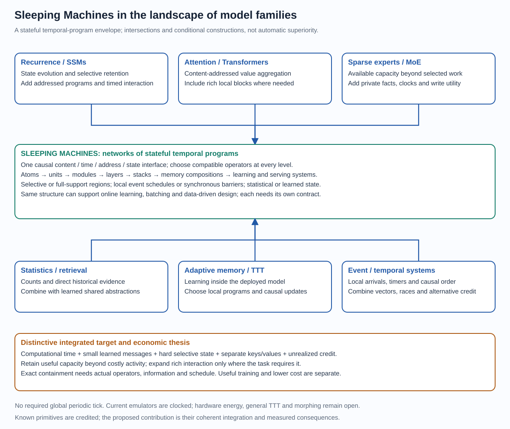
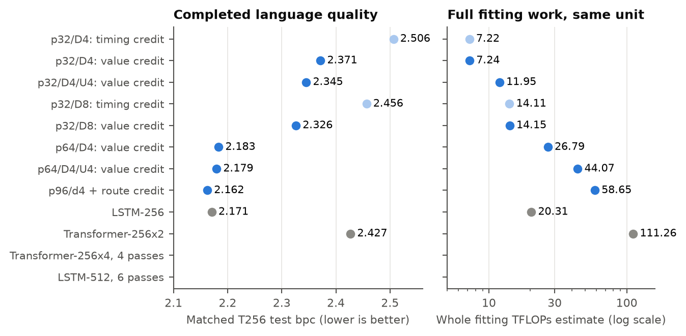
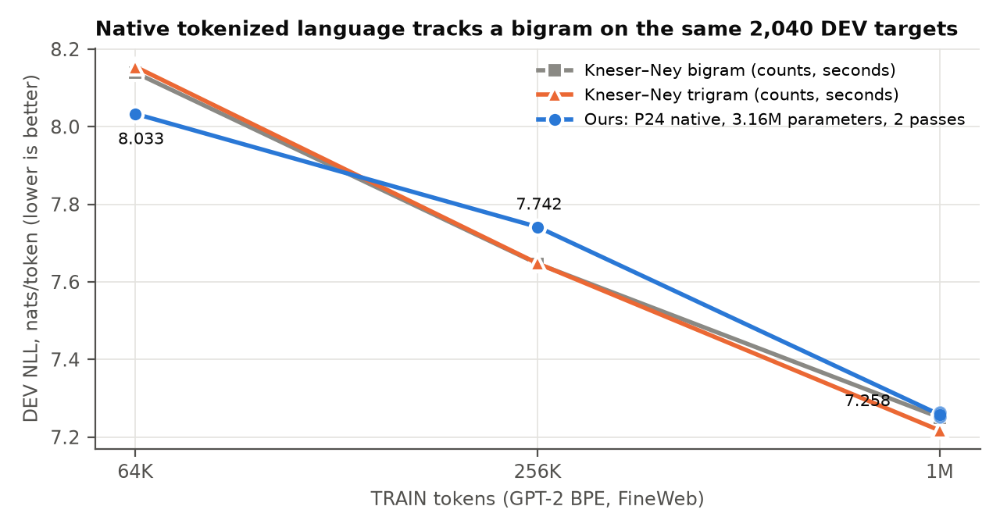

# Sleeping Machines — Part I: The science

A trainable computing substrate that computes through time

Tero Keski-Valkama and Karoliina Salminen · Research report, Part I · 6 October 2026

This is the reader-facing report: the ambition, the model family and its theory, what the evidence shows on each front, and the experiments that decide the next step. Two companion parts hold the rest. [Part II — Methods and machinery](II_METHODS.md) collects protocols, metric definitions, compute accounting, numerical contracts and implementation checks. [Part III — Experiment record](III_RECORD.md) preserves every experiment entry and the earlier narrative chapters verbatim. `REPORT.md` remains the complete combined record; Parts II and III are generated from it by `report/split_report.py`.

## 1. The ambition

Sleeping Machines aims to make intelligence composable within **one trainable computing substrate**. Language and reasoning, multimodal world models, embodied action, event-native analytics over interleaved process streams, and typed tables become different forms of experience available to the same learner. The ambition extends through continual and on-device learning, learned communication and self-designing models to the hardware that executes them: globally clockless, memory-local event hardware that learns on chip.

An observation enters through an interface that respects its meaning: a token, a sensory event, a typed comparison or an action. It becomes an addressed message that interacts with persistent memory. Learned delays and temporal races decide which evidence meets and which computation happens. Small messages carry new evidence into deeper state; separate keys and values distinguish where evidence goes from what it says. Counterfactual credit teaches the routes and writes that could have happened. Available memory and skill can grow beyond the activity recruited for any one observation.

Each benchmark below is evidence for one front of this program. None of them defines the project.

### Wins and advances at a glance (9 October 2026)

**Nine public leaderboard wins**, each on the official splits with a sealed test scored once per run, 40 of 41 independent
runs ahead of the best published result:

| Benchmark | Ours | Best published | At what cost |
| --- | --- | --- | --- |
| EasyTPP Taxi (mobility events) | 0.525 ± 0.001 | 0.522 (S2P2, NeurIPS 2025) | 1/12 of the leader's parameters and compute; **reproduced independently on separate hardware** |
| EasyTPP Taobao (shopping) | 1.399 ± 0.003 | 1.318 (IFTPP) | 0.92× the leader's compute; largest margin (+0.081) |
| EasyTPP StackOverflow (Q&A activity) | −2.153 ± 0.005 | −2.163 (S2P2) | **matched size and compute**; all 5 seeds ahead |
| EasyTPP Retweet (social cascades) | −6.326 ± 0.001 | −6.348 (NHP) | **1/15** of S2P2's parameters and compute |
| EasyTPP Amazon (shopping reviews) | 0.803 ± 0.001 | 0.781 (S2P2) | 0.29× the leader's compute |
| P19 ICU sepsis prediction | AUPRC 0.639, AUROC 0.916 | 0.583 / 0.903 (MTM) | temporal memory adds +0.072 AUPRC on every split beyond summary statistics; reproduced |
| PAM wearable activity recognition | accuracy 0.978, F1 0.980 | 0.975 / 0.976 (MTM) | 46K parameters vs MTM's 873K |
| **TGB tgbn-trade** (temporal graph: node affinity, world trade) | NDCG@10 0.868 ± 0.0005 | 0.863 (NAVIS, ICLR 2026) | 2,107 parameters, 4 CPU-minutes; **a new domain**: interaction graphs, where heuristics beat every temporal GNN |
| **TGB tgbl-wiki** (temporal graph: link prediction, Wikipedia edits) | MRR 0.835 ± 0.0003 | 0.827 (TPNet) | 7,995 parameters; exact per-event state; 4.5 ms per query on one CPU thread |

**Rigor:** pre-registered reporting rules; the benchmark's own scorer agrees; a recording-grid audit every win passes; a
one-command kit for third-party reproduction. **One configuration wins all five:** a single configuration with no per-dataset tuning is ahead of the best
published result on all five EasyTPP datasets under a pre-registered protocol (24 of 25 seeds ahead): Taobao 1.397,
Taxi 0.526, StackOverflow −2.144, Retweet −6.324, Amazon 0.802.

**Advances beyond the leaderboards:**
- **Tokenized language:** 6.009 ± 0.010 nats per token vs a Kneser–Ney trigram's 6.537 on GPT-2-tokenized FineWeb (3 seeds);
  at 4× the data 5.510 vs 6.100, so the lead grows with data.
- **Binding and recall:** associative recall across irregular gaps 97.5% (3 seeds) vs a 14% baseline, 91.6% at twice the
  training length (seed 0; three-seed mean 90.2 ± 1.2%); **learning through the race alone** (no backpropagation into the network) reaches 77%.
- **Learning without a backward sweep or weight transport:** a race-of-clocks event model learns from each event as it
  arrives, with exact memory credit carried forward. On Taxi development data, at the same 20 data passes, it scores
  0.4805 nats/event against 0.4557 for backpropagation through time (3 seeds). Its backward weights can be separate
  from the forward ones when trained by the forward pass's own updates: they align to the exact dual (cosine 1.000) and
  learn as well as shared weights (0.4715 vs 0.4736), where fixed random feedback fails (0.17). This is a fully local
  learner, the learning half of clockless hardware. ([theory note 160](../experiments/theory/160_forward_backward_duality_and_credit.md))
- **Generative mode:** the same race-of-clocks model samples realistic event streams exactly (no rejection), for simulation,
  what-if analysis and synthetic data; taxi streams match real timing (gap KS 0.014 vs 0.063 naive) and event-to-event
  structure (0.024 vs 0.53).
- **Exact training signal and measured speed:** the closed-form likelihood removes the Monte Carlo gradient noise that
  sampled-intensity models carry (18% relative noise at the common 10-sample setting, measured); a streaming per-event
  update runs at about 1,500 events per second on one CPU core in plain PyTorch (Taxi; 20.7K multiply-adds per event vs
  the leader's 250K). A race of clocks provably approximates any continuous inter-event density, confirmed numerically; likelihood saturates once the number of clocks covers the data's gap modes (predicted, then confirmed), so model size follows from the data.
- **Reasoning from few examples:** temporal event chains 99.7% vs Transformers 33–41%; race retrieval 100% at 4× context.
- **Character language:** beats tuned Transformers at equal or lower compute (text8, 10M characters).
- **Learning signal and capacity:** credit to unchosen routes cuts error by 0.14 bits per character for 0.3% more work;
  doubling memory slots lowers error with the same eight writes per input.
- **Generality:** one shared temporal core serves four event domains; anonymous interleaved process logs (FAS v1) beat six
  generic detectors across three seeds.
- **Theory:** a race of clocks contains softmax attention and Mamba-style selective state spaces exactly.

**New event domains (9 October):**
- **Temporal Graph Benchmark, node affinity: won** (table). Pre-registered sealed test, 3 seeds: 0.8683 / 0.8674 /
  0.8683, every seed above NAVIS's 0.863; persistent forecast 0.855. Validation 0.874 vs 0.860 had predicted it.
- **Temporal Graph Benchmark, link prediction: won** (table). Exact per-event state lifted our model from 0.776 to
  0.852 validation MRR (theory note 159 predicted at least +0.03); three pre-registered sealed seeds score 0.8353 /
  0.8350 / 0.8356 on test, every one above TPNet's 0.827, with 7,995 parameters. On tgbl-review a training-free decayed
  event state already reaches 0.344 validation MRR, above TGN, TGAT and TNCN (0.313–0.325); GraphMixer leads at 0.428.
- **Second neural-TPP benchmark** (Bosser & Ben Taieb; 7 datasets × 5 fixed splits; total NLL per sequence, lower is
  better): the frozen one-configuration EasyTPP model, with no tuning, has five completed verdicts. **Wikipedia won:**
  −240.42 ± 43.31 SE vs the bar −122.62 (best published time + best published mark NLL), 4 of 5 splits below it. The win
  is in the marks, 28.49 vs 144.79. Our addressed mark memory copies pages never seen in training (10–27% of test edits),
  which per-mark embeddings cannot do; the best published GRU model scores marks as if uniform. **MOOC lost:** −226.85 ±
  2.83 SE vs −239.7; timing carries the gap, and it is the recording grid: the authors' own log-normal-mixture model,
  trained with their code, gains 16.9 nats per sequence on MOOC from timestamp rounding and falls about 5 nats behind
  our time NLL once gaps are spread within the recording cell (ours moves ≤ 0.4). **Stack Overflow lost:** 12.714 ± 0.874 SE vs 11.9; its time NLL beats the
  published time component (−91.598 vs −91.1), while mark NLL trails (104.312 vs 103.0). **MIMIC2 lost** (7.01 vs
  2.42; its mark path overfits ~100-sequence training sets). **Github has no valid verdict yet:** its −198.5 (bar −272.9)
  comes from four of five splits whose weights went NaN by epoch 8 after one non-finite update, leaving epoch 2–3
  checkpoints; guarded protocol reruns (TEST once, configuration unchanged) are queued, as for Wikipedia split 0. **Retweets lost:** −515.16 ± 3.24 SE vs −538.70; marks are level with the best published (83.65 vs 82.63), and timing carries the gap (−598.81 vs −621.33) on a one-second grid with 4% zero gaps; the authors' own model gains 113 nats per sequence on Retweets from that rounding and trails ours by about 65 nats once gaps are spread within the recording cell (ours moves ≤ 0.4). LastFM is pending. These are
  frozen-configuration transfer results; mark-path development continues outside the sealed protocol.

**Where we are behind** (stated with the numbers in the report): large-scale character language (90M), tuned LSTMs at 10M
characters, P12 mortality AUROC, real-world tables, FAS v2 (sealed-test tie: native 0.70366 vs time-encoded Transformer 0.70432 AUROC, three seeds; mean AUROC difference −0.00066; native ahead of the best classical detector's 0.68223).

## 2. The model family

Every message carries **content, an arrival time and an address**. Receivers hold persistent memories that decay and rotate with the real time elapsed between events. Candidate routes **race through learned delays**: the winner updates state and sends the next message, and the routes that did not win still receive **counterfactual credit**. Arrival order decides which memories meet and which computation happens, so delays perform computation rather than label it. Dense synchronous layers are a special case; one model can compute densely where a task needs it and selectively elsewhere.

The four architectural bets, and the mechanisms each one keeps explicit:

| Bet | Mechanisms | Why it matters |
| --- | --- | --- |
| **Time performs computation** | Learned delays, temporal races including race attention, decay and rotation by elapsed time | Selection and combination happen in the timing itself; waiting is part of the computation |
| **Hard routes learn through counterfactual credit** | Winner-only forward execution; credit to unrealized alternatives and optional routes | Discrete sparse routing is a long-standing training problem; crediting alternatives trains it without dense inference |
| **Deep persistent event representations** | Sparse addressed state updates; small messages mixing incoming content with persistent memory; separate keys and values | Memory is addressed and retained, not a buffer rescanned at every step |
| **Capacity beyond activity** | Large receiver pools, few selected writes per event | Stored skill can grow faster than the work spent per observation |

Supervision is silence-aware where the objective depends on waiting: the absence of an event until a real clock deadline is an observation, not missing data. Work is accounted separately for available capacity, scored keys, selected state updates, value deliveries and counterfactual learning work, so a dormant receiver is never reported as free to score or train. Part II gives the accounting conventions.

## 3. The theory

### 3.1 Foundational principles

The foundational calculus ([THEORY.md](../experiments/THEORY.md), §§1–25) reduces to five principles. Later notes extend each.

| | Principle | Consequence |
| --- | --- | --- |
| P1 | **Inference is tropical; unrealized futures are its dequantization.** A race computes minimums over event times (min-plus); at temperature σ the possible histories form a recombining forest weighted by e^(−cost/σ). | Near-miss weighting is the derivative of the soft minimum; credit is conserved at each collapse; holistic backpropagation is inside–outside. |
| P2 | **Weaving closes the past.** Collapses are stopping times; later inputs cannot affect them. | When to commit is an optimal-stopping problem; woven and unwoven counterfactuals differ. |
| P3 | **A race neuron is a weighted mean in time.** Within a piece, T = θ/ρ + Σ uᵢtᵢ. | Exact time-shift equivariance; urgency (ρ) and evidence (u) separate; learning must recruit absent evidence additively. |
| P4 | **Credit must reach what did not happen.** Along the realized history credit reaches only nodes that fired; the blind spot compounds with depth. | Counterfactual credit matters from depth 2; routing networks share the same boundary term. |
| P5 | **Thresholds are prices.** Homeostasis is the dual update of a capacity constraint; a race layer with homeostasis is an online entropic optimal-transport solver. | Target rates are capacities; log-ratio updates balance faster. |

### 3.2 Temporal algebra and attention

**An exponential race selects route i with probability softmax(score)ᵢ exactly, and delay-coded aggregation reproduces softmax attention exactly over the delivered keys** (theory notes [08](../experiments/theory/08_vector_memory_and_deep_stacks.md) and [151](../experiments/theory/151_normalized_clock_noise_and_precision_credit.md)). The family therefore contains a Transformer-capable function class. **Selective state-space models (Mamba) are also exact members:** each token is an event delivered after a learned, content-dependent delay, memories decay over the elapsed time, and writes and reads are content-addressed; this reproduces Mamba-1 and Mamba-2 selective scans to 4e−13, and rotating memories extend it ([note](../experiments/theory/MAMBA_CONTAINMENT_20261007.md)). A winner-only race delivers the sampled winner's value instead of the weighted average and skips the value-aggregation half of attention arithmetic. One winner is a sample, not the average: averaging m independent winners has mean-square error variance/m.

With width d, depth L, N historical keys, feed-forward expansion r and shared projection work B = (8 + 4r)d² per layer, S extra evolving-state work per layer, P updated parameters and U targets per Adam update (two FLOPs per multiply-add):

| Per token / target | Transformer | Race substitution |
| --- | --- | --- |
| Inference | L(B + 4Nd) | L(B + 2Nd + S) |
| Training, approximate | 3LB + 12LNd + 19P/U | 3L(B + S) + 10LNd + 20P/U |
| Logical value reads (FP32) | 4LNd bytes | 4Ld bytes |
| Logical key + value reads | 8LNd bytes | 4L(N + 1)d bytes |

The race training term charges admitted losing-value credit; it is not winner-only training. At fixed width the attention-only arithmetic limit is about 2× at inference and 1.2× during counterfactual training, and total key/value access improves by at most about 2×. Larger gains require richer temporal computation to reach the same quality at smaller width αd and depth βL: projection work scales by βα² and context work by βα. These are logical counts, not measured off-chip traffic or joules.

### 3.3 Keys, values, credit and depth

- **Key/value separation** ([note 22](../experiments/theory/22_key_value_separation_and_race_boundaries.md), §§194–196) isolates harmful winner changes, preserves actual routing during smooth value learning, and derives joint key/value/clock counterfactual policy credit with its reachability requirements.
- **Statistic-valued race memory** ([note 59](../experiments/theory/59_statistic_valued_race_memory.md), §§382–392): learned keys with sufficient-statistic values give zero-variance counterfactual route credit and closed-form write credit. Hierarchical count backoff is an exact cascade of escape races ([note 58](../experiments/theory/58_sufficient_statistic_state_and_count_references.md)).
- **Capacity, trainability and inductive bias** ([note 158](../experiments/theory/158_capacity_trainability_inductive_bias.md), §§449–456): a race of exponential and defective delayed clocks approximates any continuous inter-event density on compact gap ranges, and hazard-weighted mark mixtures give any continuous time-dependent mark law; memory fades in real time, not position. Training is on an exact likelihood in which every silent clock is taught through its survival. The family assumes that relevance fades with elapsed time, that each event is the first of several competing processes, that silence is informative and that types update their own memory, which is why it wins on event data and predicts where dense models keep an edge. Its predictions were tested: likelihood saturates once the number of delayed clocks covers the gap distribution's components (2 components: saturated at 2 clocks; 6 components: at 8; confirmed), so clock count is chosen from the data's modes; the exact likelihood removes the 18% Monte Carlo gradient noise of sampled-intensity training (confirmed); the race's timing advantage *shrinks* as more independent processes are merged (0.99 → 0.21 nats per event from 1 to 8 processes, by the Palm–Khintchine theorem), so on superposed streams the value lies in binding (prediction revised); and elapsed-time memory matters where relevance decays in calendar time (StackOverflow −0.057 without it) but not on Taobao (prediction revised). Binding needs the predecessor's message ([note 156](../experiments/theory/156_predecessor_message_binding.md)); interleaved processes need duration-matched predecessor attention ([note 157](../experiments/theory/157_deinterleaving_by_duration_matched_attention.md)).
- **Depth** ([notes 04, 08c](../experiments/theory/08c_sparse_attention_and_depth_bounds.md)): residual depth and temporal gauges, sparse-attention depth bounds, and the conditional depth bounds of causal context bridges. Counterfactual credit matters from depth 2 because the realized-history blind spot compounds with depth (P4).
- **Compute allocation**: the useful quantity is prediction quality at a fully counted budget of fitting, inference and learning work, including candidate discovery and losing-value credit. Capacity, activity and teaching work are separate axes (§§299–302, [note 46](../experiments/theory/46_integrated_sparse_temporal_language.md)).
- **Typed semantics** ([TYPED_SEMANTICS_AND_RACE_COMPOSITION](../experiments/theory/TYPED_SEMANTICS_AND_RACE_COMPOSITION_20261006.md)): type-respecting comparisons (numeric, ordinal, categorical, missingness) enter before neural mixing, with the equivariance conditions learning must satisfy. 39 mathematical/interface contracts pass.

## 4. Evidence, front by front

Conventions for every table in this section: single seed unless a seed count is stated; native fitting work is traced (and extrapolated from traced windows for long fits), dense references use shape estimates; "train compute" counts the complete fit including counterfactual credit and optimizer work. Every number comes from a completed result file; pending cells say pending.

### 4.0 Public benchmark: temporal point processes (EasyTPP)

Marked event streams with continuous times, on the official EasyTPP splits and the per-event log-likelihood protocol of the published state of the art (S2P2, NeurIPS 2025; [B1 dossier](../experiments/B1_EASYTPP.md)). Our model is a race of delayed clocks over persistent temporal memory: after each event, exponential clocks and delayed clocks that may stay silent race, and the first to fire sets the next event's time and mark. The likelihood is exact; losing clocks are credited through the survival term. Clocks may not resolve time below the data's recording resolution. Five seeds; TEST scored once per seed at the best DEV checkpoint.

**One configuration wins all five datasets (pre-registered unified protocol, 8 October 2026).** A single model
configuration, with no per-dataset tuning, is ahead of the best published result on every EasyTPP dataset. Two rules are
read from the data: window clocks are used only when the training gap distribution separates into two or more components
(Amazon, Retweet), and each dataset's timestamp resolution sets the recording cell. Five seeds, sealed test, every
checkpoint scored once after exact reproduction of its development score:

| Unified model (nats/event, higher is better) | Ours | Best published | Seeds ahead | Per-event compute vs S2P2 |
| --- | --- | --- | --- | --- |
| Taobao | **1.3967 ± 0.0031** | 1.318 (IFTPP) | 5/5 | 1.03× |
| Taxi | **0.5262 ± 0.0034** | 0.522 (S2P2) | 4/5 | **0.09×** |
| StackOverflow | **−2.1436 ± 0.0029** | −2.163 (S2P2) | 5/5 | 1.015× |
| Retweet | **−6.3242 ± 0.0021** | −6.348 (NHP) | 5/5 | **0.07×** |
| Amazon | **0.8017 ± 0.0006** | 0.781 (S2P2) | 5/5 | **0.24×** |

24 of 25 runs are ahead (Taxi seed 2: 0.521). The single configuration exceeds our own dedicated models on Taxi (0.5250),
StackOverflow (−2.1444) and Retweet (−6.3262). Retweet recording-grid audit drops 0.007–0.009 nats/event on every seed,
about a third of the margin. EasyTPP's own Monte Carlo estimator agrees with the exact scores on all 25 checkpoints within its sampling noise.

| Taxi (nats/event, higher is better) | Total | Time | Mark | Parameters | Inference MACs/event |
| --- | --- | --- | --- | --- | --- |
| Best published (S2P2) | 0.522 ± 0.004 | 0.733 | −0.211 | 251,850 | 249,856 |
| **Ours, single model** | **0.5250 ± 0.0010** | 0.733 | **−0.208** | **20,504** | **20,708** |
| **Ours, 5-seed predictive mixture** | **0.5363** | **0.740** | **−0.204** | 102,520 | 103,540 |

| Taobao (nats/event) | Total | Time | Mark | Parameters | Inference MACs/event |
| --- | --- | --- | --- | --- | --- |
| Best published (IFTPP) | 1.318 ± 0.017 | 2.708 | −1.391 | — | — |
| S2P2 | 1.304 ± 0.039 | 2.719 | −1.415 | 26,801 | 26,016 |
| **Ours, single model** | **1.3991 ± 0.0025** | **2.753** | **−1.353** | **24,046** | **24,362** |

| StackOverflow (nats/event) | Total | Time | Mark | Parameters | Inference MACs/event |
| --- | --- | --- | --- | --- | --- |
| Best published (S2P2) | −2.163 ± 0.009 | −0.641 | −1.521 | 30,166 | 29,216 |
| **Ours, single model (with continuous-time state clock)** | **−2.1444 ± 0.0037** | −0.643 | **−1.501** | 36,183 | 36,732 |
| **Ours, matched size (2 layers)** | **−2.1525 ± 0.0045** | −0.646 | **−1.506** | **29,191** | **29,660** |

| Amazon (nats/event) | Total | Time | Mark | Parameters | Inference MACs/event |
| --- | --- | --- | --- | --- | --- |
| Best published (S2P2) | 0.781 ± 0.011 | 2.652 | −1.871 | 127,056 | 125,568 |
| **Ours, single model (anchored delay windows)** | **0.8028 ± 0.0007** | **2.657** | **−1.854** | **35,000** | **35,936** |

| Retweet (nats/event) | Total | Time | Mark | Parameters | Inference MACs/event |
| --- | --- | --- | --- | --- | --- |
| Best published (NHP) | −6.348 | −5.584 | −0.764 | — | — |
| S2P2 | −6.365 | — | — | 298,627 | 297,600 |
| **Ours, single model (every clock held below the 1 s recording cell)** | **−6.3262 ± 0.0009** | −5.558 | −0.768 | **19,654** | **19,850** |

**Win on StackOverflow, confirmed over 5 seeds:** +0.019 nats per event over the best published model, with the best mark log-likelihood and time level with the best, at 1.26× S2P2's per-event work; **a matched-size model (fewer parameters than S2P2, 1.015× its per-event work) also wins, with all five seeds above S2P2**. The gain comes from a state clock: a persistent memory that keeps evolving through the silent interval drives part of the hazard.

**Win on Taobao, confirmed over 5 seeds:** +0.081 nats per event over the best published model, with the best time and mark log-likelihoods, at 0.92× S2P2's per-event work.

**Win on Amazon, confirmed over 5 seeds:** +0.022 nats per event over S2P2, every seed ahead (0.8021 to 0.8036), with the best published time and mark log-likelihoods, at 0.29× S2P2's per-event work and 3.6× fewer parameters, one run per seed and no restarts. The earlier protocol (0.784 ± 0.027 with three restarts per seed) had one seed in a low optimization basin; free delay windows drifted beyond every observed gap, and anchoring each window to its gap component removed the basin. EasyTPP's Monte Carlo estimator gives 0.8037 to 0.8060. Amazon's times have no recording grid (281K distinct gaps, no zero gaps).

**Win on Retweet, confirmed over 5 seeds:** +0.022 nats per event over the best published model (NHP) and +0.039 over S2P2, every seed ahead (−6.3250 to −6.3272), with the best time log-likelihood, at 1/15 of S2P2's parameters and per-event work. Retweet times are recorded in whole seconds; every clock holds its one-cell hazard below the cell, and the recording-grid audit moves the score by 0.004, a fifth of the margin. Under EasyTPP's own Monte Carlo estimator the seeds score −6.3252 to −6.3277.

**Win on Taxi, confirmed over 5 seeds:** the 5-seed mixture beats every published model on total, time (best published 0.735) and mark log-likelihood at 0.41× S2P2's per-event inference work; a single model leads S2P2 on the mean at 1/12 of its parameters and per-event work. The earlier StackOverflow model (v5, without the state clock) was 0.018 behind S2P2 (−2.181 vs −2.163), its 5-seed mixture ahead (−2.154) at 4.6× compute; the state-clock model above supersedes it.  The Taxi win reproduces on independent hardware (curie desktop CPU, separately downloaded data, frozen driver, five seeds): 0.5252 ± 0.0007 vs 0.5250 ± 0.0010 on AWS, every seed above S2P2's mean. All winning results pass a recording-grid audit (scores unchanged when event times are dequantized within their recording resolution; Retweet within 0.004 nats). S2P2 parameters and MACs are counted from its released layer definitions at its published configuration.

### 4.0b Public benchmark: irregular clinical time series (P19 sepsis)

PhysioNet 2019 sepsis prediction on the five official Raindrop splits (38,803 ICU stays, 34 irregularly sampled channels, 4.2% positive). Our event-native classifier treats each time step as an event; addressed channel memories carry sufficient statistics (count, mean, min, max, first, last, trend, staleness) and decay with elapsed time; values enter through typed comparisons; silence (time since a channel was last measured) is an input ([B2 dossier](../experiments/B2_IRREGULAR_TS.md)).

| P19, 5 official splits | TEST AUROC | TEST AUPRC |
| --- | --- | --- |
| Best published (MTM, 2025) | 0.903 ± 0.020 | 0.583 ± 0.053 |
| **Ours (62,681 parameters; MTM reports 873K for its PAM configuration)** | **0.916 ± 0.022** | **0.639 ± 0.039** |

**Win on P19 over the best published model**, with AUPRC — the clinically relevant metric at 4% prevalence — ahead by more than either model's split spread. **Where the margin comes from** (paired five-split tests, 8 Oct): removing the model's temporal memory (same network reading only its statistic slots) drops it to 0.900 / 0.572 on every split (paired ΔAUPRC +0.072, t = 31), and gradient-boosted trees on the same statistics score 0.914 / 0.618: the temporal memory carries signal the statistics lack, and the model leads the trees on AUPRC on every split (+0.026, paired t = 4.2; AUROC level). The result reproduces from scratch on separate hardware (AUROC within 0.0004 on all five splits). A rank blend of the model and the trees scores 0.925 / 0.671, above both on every split: the model holds information the summaries lack. On P12 (in-hospital mortality, five official splits) the same configuration reaches TEST AUROC 0.871 ± 0.011 and AUPRC 0.585: behind MTM on AUROC (0.880), level on AUPRC (0.586), ahead of every other published model. PAM is in development.

**Win on PAM** (wearable activity recognition, five official splits, sealed test): accuracy **0.978 ± 0.007**, F1 **0.980 ± 0.008** vs MTM 0.975 ± 0.002 / 0.976 ± 0.002, with 46,316 parameters; four of five splits ahead (0.979, 0.981, 0.981, 0.981; split 4 0.964).

### 4.0c One family across data types

The same construction — persistent memories that decay and rotate with elapsed time, addressed memory written sparsely, typed comparisons, silence as information, and temporal races — wins public benchmarks of different kinds. The P19 classifier imports the very temporal memory layer of the EasyTPP model, at the same size (32 wide, 16 modes, 2 layers).

| Data type | Benchmark | Result |
| --- | --- | --- |
| Generative event streams (when and what happens next) | EasyTPP, 5 datasets | **Wins on all 5** (Taxi, Taobao, StackOverflow, Retweet, Amazon), **including with one configuration for all five** |
| Irregular clinical records (classification) | P19 sepsis, official splits | **Win**, AUPRC 0.639 vs 0.583 |
| Wearable sensors (activity recognition) | PAM, official splits | **Win**, accuracy 0.978 vs 0.975 (4 of 5 splits ahead) |
| Anonymous interleaved process logs | FAS v1, 3 seeds | **Win** vs six generic controls, 0.592 vs 0.559 AUROC |
| Character language | text8, 10M characters | **Win** vs tuned Transformers at ≤ equal compute; **loss** to tuned LSTMs; **loss** at 90M |
| Temporal reasoning from few examples | synthetic, 5 runs | 99.7% vs Transformers 33–41% |
| Mixed-type tables | synthetic; banknote | learns the synthetic interaction; **trees lead** on banknote |

**One shared core across four event domains (G2, development data, one seed).** A single temporal memory (14,080 parameters) trained on Taxi, Taobao, StackOverflow and Amazon at once, with dataset-specific mark embeddings and clock heads (68,910 parameters in total, against about 111,000 for four separate models), matches or beats the separate models on three of four: Taxi DEV 0.4899 vs 0.4872, Taobao 1.2895 vs 1.284, StackOverflow −2.186 vs −2.177 (same design without the state clock). Amazon trails (0.683 vs 0.69–0.77 across seeds) and was still improving at the last epoch, while the other three peaked by epoch 40; per-dataset schedules in the joint run are the next test. Mobility, shopping and Q&A timing share one learned temporal dynamics.

**Positioning.** The EasyTPP leader S2P2 (NeurIPS 2025) is demonstrated on one task type, event likelihood. Its parent family, deep state-space models, is general on dense sequences and language. Our claim is specific: one family, with one shared core, wins public benchmarks on both generative event modelling and sparse clinical classification, with further evidence on process logs, language and reasoning. The tests that make this a transfer claim — self-supervised event pretraining for clinical prediction, one model across five event datasets — are track G ([plan](../experiments/GENERALITY_PLAN.md)).

### 4.0d Public benchmarks: temporal interaction graphs (TGB)

The Temporal Graph Benchmark asks which entity interacts with which, and when. On its node-affinity task, simple
heuristics (persistent forecast, moving average) beat every temporal graph neural network, and the leader NAVIS (ICLR
2026) is a gated linear state-space model whose output is always a convex combination of past affinity vectors.

| tgbn-trade (world trade, test NDCG@10) | Score | Parameters |
| --- | --- | --- |
| **Ours** (race over destinations, multi-timescale decayed affinities, reciprocity, global share and growth) | **0.8680 ± 0.0005** (3 seeds, every seed ahead) | 2,107 |
| NAVIS (leader) | 0.863 ± 0.001 | 1,280 |
| Persistent forecast | 0.855 | 0 |
| Moving average / TGNv2 / DyGFormer | 0.823 / 0.735 / 0.388 | — |

Official loader and evaluator, configuration fixed before the test, test scored once per seed; about four minutes of
fitting on one CPU thread and 0.22 ms per prediction (measured, one thread). Theory note 159 explains the margin: our readout contains persistent forecast and moving
averages as special cases and can extrapolate a rising partner, which a convex combination of past vectors cannot
(Proposition 3). Ablations bear this out in part: removing the history-shape features gives back half of the gain over
persistent forecast (validation 0.8677 vs 0.8747; persistent forecast 0.8604), while removing reciprocity costs nothing. On link prediction (tgbl-wiki), updating the state exactly at every event,
as the family does natively, lifted validation MRR from 0.776 to 0.852 against TPNet's 0.842 with 7,995 parameters; its
three pre-registered sealed seeds score **0.8353 ± 0.0003 on test against TPNet's 0.827**, every seed ahead: a second TGB
win. One query, with the exact state update and all 1,000 candidates scored, takes 4.5 ms on one CPU thread.

### 4.1 Learned temporal computation (synthetic, multi-run)

| Task | Ours | Reference | Verdict |
| --- | --- | --- | --- |
| Depth-3 event chains, 2,000 examples seen once (5 runs) | **99.73–99.93%** | Transformers 33.25–40.80% (same distinct examples, repeated fitting) | **Win** |
| Race retrieval at 4× training context (5 runs) | **100%** within 4,000 examples | Best of seven Transformer configurations, lower | **Win** |
| Unseen mod-17 triples via a learned phase rule | **100%** of 3,440 | — | Solved |
| Timing-only discrimination (identical marks, addresses, order) | **95.31%** | Order-only control 50.00% (exact ceiling) | **Win** |
| 16-source order, shared rules with private memories | **75.39%**, 14,180 parameters | Private rules 44.14%, 157,940 parameters | **Win** (11.1× fewer parameters) |

These are structured tasks with declared priors; they establish that the mechanisms learn order, timing and retrieval from few examples. Elapsed time is used as information: clearing persistent state drops the timing task to 50%.

### 4.2 Hard-route credit and capacity beyond activity (text8, 10M characters, one pass)

| Change | Test bpc | Cost |
| --- | --- | --- |
| Value-informed alternative credit, p32/D4 | 2.507 → **2.371** | +0.3% fitting work; forward unchanged |
| Same credit at depth 8 | 2.456 → **2.326** | |
| Double the receiver pool at 8 selected writes/char | 2.371 → **2.345** | 1.65× fitting work; inference arithmetic flat (0.163 → 0.164 MFLOPs/position) |

Counterfactual credit to unrealized alternatives works, at depth, for almost no extra work, and stored capacity improves quality without raising inference arithmetic.

### 4.3 Character language (text8)

Same test interval text8[95M:96M]; native and Transformers score reset T256 windows, LSTMs carry state; budgets are complete training compute.

| Data | Budget | Ours | Tuned LSTM | Tuned Transformer | Verdict |
| --- | --- | --- | --- | --- | --- |
| 10M | ≤ 352 TF | **1.888** (p96/d4, 6 passes) | 1.826 (LSTM-512) | 1.996 (TF128×4) | Win vs Transformers; **loss** vs LSTM |
| 10M | ≤ 107 TF | **1.955** (p64/d4, 4 passes) | 1.915 (LSTM-384) | 2.215 (TF128×4) | Win vs Transformers; **loss** vs LSTM |
| 10M | 888.8 TF (TF) | 1.888 at 352 TF (0.40×) and 0.18× inference | — | 1.908 (TF256×4, 4 passes) | **Win**: better quality at 0.40× training, 0.18× inference compute |
| 90M | C, ≈ 0.96 PF | 1.800 (p64/d4, 0.97 PF) | 1.729 (LSTM-512, 0.91 PF) | 1.780 (TF192×4, 0.95 PF) | **Loss** to both |
| 90M | D, ≈ 2.1 PF | 1.783 (p96/d4, 2.11 PF) | — | 1.704 (TF192×4, 2.07 PF); 1.811 (TF256×4, 2.00 PF) | **Win** vs TF256×4 at near-equal compute (1.06×); **loss** to TF192×4 |

At 10M characters the native model beats tuned Transformers at equal or lower compute; tuned LSTMs lead. At 90M both dense families lead, and the gap to the best dense reference is wider than at 10M (0.07–0.08 bpc versus 0.04–0.06). The direction of that trend is the central problem for the language front.

### 4.4 Properly tokenized language (FineWeb, GPT-2 BPE)

Fixed P24 integrated model, 3.16M parameters, two passes; DEV is 2,040 next-token targets (8 lanes × 255) from the FineWeb validation shard; count references are fitted on the identical TRAIN prefix and scored on the identical targets ([result](../experiments/results/token_language/aws_token_ngram_reference_20261006T143000Z.json), `experiments/token_ngram_reference.py`).

| TRAIN tokens | Ours (DEV NLL, nats) | Kneser–Ney bigram | Kneser–Ney trigram | Add-one unigram |
| --- | --- | --- | --- | --- |
| 64K | **8.033** | 8.139 | 8.155 | 8.162 |
| 256K | 7.742 | **7.647** | 7.648 | 7.972 |
| 1M | 7.252 / 7.264 (seeds 6 / 7) | 7.251 | **7.217** | 7.950 |

**The native tokenized model currently performs at bigram level.** It beats the count models at 64K tokens, trails them at 256K, and ties the bigram at 1M while the trigram leads by 0.03–0.05 nats. The count models fit in seconds; the native 1M fit took 73 minutes at 480 training tokens/s on one CPU thread. Erasing persistent memory raises native loss by only 0.010 / 0.017 nats (seeds 6 / 7): memory is used, but carries little.

The 2,040-target DEV slice has a standard error of about 0.09 nats for an unpaired mean and is harder than average: on 65,528 targets from the same offset the bigram scores 6.584 at 1M rather than 7.251. Differences of 0.02 nats on this slice, such as the 256K time-scale pair (+0.018 on seed 6, −0.022 on seed 7), do not separate variants. Native models are next scored on the larger slice.

Two further completed results: credit window 64 lost to credit window 16 by 0.129 nats at 64K tokens (credit 16 retained), and slower memory evolution increased stored-content dependence in both seeds (payload erasure 0.043 / 0.032 versus 0.011 / 0.014) without a replicated quality gain.

### 4.5 Anonymous interleaved processes (FAS v1)

Early fault detection from anonymous interleaved event logs; test 2,000 clean and 2,000 faulty runs; references are six generic controls fitted on the same anonymous inputs.

| Native seed | AUROC at 256 events | AUROC at 512 events |
| --- | --- | --- |
| 6 | **0.5998** | **0.7422** |
| 7 | **0.5910** | **0.7360** |
| 8 | **0.5864** | **0.7329** |
| Best generic control | 0.5587 | 0.7272 |

**Replicated win: all three seeds beat the best generic control at both horizons**, by +0.028 to +0.041 at 256 events and +0.006 to +0.015 at 512. FIFO and timing-aware de-interleaving learn their routes from hidden training identities; they are oracle-assisted diagnostics and are excluded from the comparison.

**FAS v2 (B3, sealed confirmation complete): TIE.** Two production lines merge into an anonymous log with 2% of events dropped, scored at 512 events per line. Native seeds 6/7/8 score AUROC 0.70204 / 0.69557 / 0.71336, mean **0.70366**. The time-encoded Transformer reference scores **0.70432** over three seeds; LSTM 0.67374, best classical detector 0.68223. Native minus strongest reference is −0.00066, paired bootstrap of seed-averaged ranks 95% [−0.00834, 0.00747] (the margin uses mean per-seed AUROC). This is a tie under the pre-registered 0.02-margin rule. Neural references were admitted under the explicit FAS exception; all fits/selection used TRAIN/VAL before once-only TEST scoring. Identity-trained de-interleaving remains an oracle-assisted diagnostic, excluded from reference selection. Completed scorer, ledger and decision evidence are retained; the original TEST is not a development set. [Registered decision](../experiments/results/fas/curie_b3_sealed_v4_20261010T0220Z_decision.json).

The model being developed for it follows from the theory of interleaving:
- A merged log of timed processes is a superposition. Its next event is the earliest pending event of the hidden processes, which is a race.
- A race readout gives each memory slot its own clock and own-duration law, and scores the next event by the exact superposition likelihood.
- Writing each event to the slot whose race most likely produced it is a particle filter: it trains a lower bound on the likelihood marginalised over all interleavings, with no learned write credit (theory §§432–436).
- In a small integrated fit on synthetic interleaved processes, binding purity rose from chance (0.27) to 0.81 against a Bayes-greedy ceiling of 0.91.

### 4.6 Typed tables

| Task | Ours | Reference | Verdict |
| --- | --- | --- | --- |
| Synthetic mixed-type interaction, 64 FIT rows | **100%** on 256 DEV rows, 6,370 parameters | — | Mechanism learns (fixed predicates, one seed) |
| Banknote, reserved test, 3 seeds | 91.8% | Boosted trees 94.0%; logistic regression 94.7% | Behind; first-pass variant |

### 4.7 Public benchmarks, speech and adaptation

Attempt levels follow [WIN_CRITERIA.md](../experiments/WIN_CRITERIA.md). A first-pass variant is an existing member with at most knob-level tuning and no task-specific design; its result describes that variant, not the family. These benchmarks are not current battles.

| Benchmark | Ours | Reference | Verdict |
| --- | --- | --- | --- |
| NeuroBench Mackey-Glass, τ 17, 30 repeats (sMAPE) | 14.84, 57.6 KB | LSTM 13.37 (490 KB), ESN 14.79 | Behind; first-pass variant; smallest footprint |
| NeuroBench primate reaching, 5 of 6 official sessions (R²) | 0.619 paired mean | tinyRSNN 0.643, bigRSNN 0.683; leaderboard 0.71 | Behind; first-pass variant |
| Spiking speech, 512 private held-speaker utterances | 79.69% | Published SHD official test: 94–96% (different partition) | Official comparison pending |
| Online adaptation to a new character stream | 3.191 → 3.096 bpc | — | Adapts during use |

### 4.8 Learning dynamics: grokking

On a harder modular task (train fraction 0.25), larger pools grok later (untied pool 2: 4,750 steps; pool 8: 8,000), and **asymmetric memory decay — private decay 10× shared — groks 1.7× sooner** (4,750 versus 8,250 steps for tied pool 8), as theory §427.3 predicted. Single seed.

### 4.5 Binding: the predecessor message (R1 recall gate and tokenized language)

**Recall with irregular gaps** (R1 gate 1; [dossier](../experiments/R1_RECALL.md), [theory note 156](../experiments/theory/156_predecessor_message_binding.md)): 8 key–value pairs then 8 queries drawn with replacement, inter-pair gaps spanning three decades, 32 keys / 32 values; the set baseline guesses among the shown values. Model: the B1 race-of-clocks event model with a keyed mark memory whose written keys carry the predecessor's message. TEST, 1,000 sequences.

| Model | Recall, 8 pairs | Recall, 2× length |
| --- | --- | --- |
| **Keyed read + predecessor message, 3 seeds** | **97.5 ± 1.7%** | 73.8 ± 14.7% |
| Same, trained on mixed lengths (4–16 pairs), seed 0 | **99.2%** | **91.6% at 32 pairs** (held out) |
| Same mixed-length configuration, 3 seeds | **99.0 ± 0.3%** | **90.2 ± 1.2% at 32 pairs** (held out; set baseline 4.9%) |
| Predecessor message + normalized match, local credit, 3 seeds | **90.0 ± 5.5%** | **41.9 ± 32.4% at 16 pairs** |
| Same, **local race credit only** (no gradient from the read into the network), 3 seeds | 77.4 ± 5.4% | 57.4 ± 5.2% |
| Keyed read without the predecessor message | 21.6% | 12.4% |
| B1 model without keyed read | 21.6% | 12.3% |
| Set baseline | 14.1% | 7.9% |

**Credit development:** an initialized two-layer optional-write contract matches the complete route/path gradient decomposition to 4.44e−16 and the conditional route-gradient mean to 1.81e−15 over 1,614 parameters. Its constructed improved predictor reduces audit variance 16-fold. That diagnostic introduces an optional write; current R1 writes are deterministic. [Theory note 163](../experiments/theory/163_sparse_continuous_producer_credit.md) instead targets the actual local-mode detachments: forward predicted cotangents plus full-support residual producer audits preserve the full raw-gradient mean. The native continuous-producer contract passes for plain and normalized keys: full-gradient decomposition error ≤1.12e−16 and audited conditional-mean error ≤6.67e−16 across 1,587 parameters. Reciprocal credit/update execution and version-bound symmetry gates also pass at depths 2, 4 and 8. A fixed 64-step frozen-teacher pilot with coarse coordinate features did not improve held-out credit calibration in most cases; development now replaces that interface with addressed state cotangents and exact elapsed-time transport. Its numerical gate passes at depths 2/4/8 (maximum cotangent error 1.39e−17). Three fixed-teacher future-intervention pilots learn TRAIN structure and choose beneficial held-out actions; connected transfer is weak in two seeds, and learned proposals add almost no coverage. The larger-data diagnostic completes: neither arm passes the three-seed conditional calibration-and-utility gate against a TRAIN-fitted fixed action. Next measure predictable conditional signal versus continuation noise and validate cached counterfactual response before further fitting. The decisive comparison measures complete learning work to reach matched quality as depth grows, including receiver, producer, replay, audits, credit fitting and optimizer work. Credit state and structural parameters may both adapt causally across regimes; actual event-time asynchronous learning is an integration target.

**The predecessor message is what makes binding learnable.** Without it the stored state carries the previous key only inside a time-weighted sum (linearly decodable at 3.9% against 3.1% chance) and the read learns nothing; with it the match ranks the right value first in 99.8% of queries, flat across pair age and elapsed time. The race's own error at the read, applied with time-decaying slot traces, learns the binding without backpropagation.

**Tokenized language** (R1 gate 2; GPT-2 BPE FineWeb, 1M TRAIN tokens; selection on a disjoint validation slice; the 65,528-target slice scored once per seed; nats per token):

| Model | 65,528-target slice |
| --- | --- |
| **Temporal-memory token model with the keyed predecessor read** (3.3M parameters), 3 seeds | **6.009 ± 0.010** |
| Same without the keyed read (seed 0) | 6.193 |
| Kneser–Ney trigram, same 1M tokens | 6.537 |
| Kneser–Ney trigram, 4M tokens | 6.100 |
| **Same model at 4M TRAIN tokens**, 2 seeds | **5.510 ± 0.016** |

The model beats the trigram at equal data by 0.53 nats per token on every seed and the trigram fitted on four times the data by 0.09, and **the margin grows with data**: at 4M tokens the model scores 5.510 ± 0.016 against the trigram's 6.100 (0.590; 2 seeds); the keyed read contributes 0.175 of the margin (seed-0 ablation). The next language reference is a published small Transformer under the same protocol.

## 5. What the evidence says

**What works.** The temporal mechanisms learn order, timing and retrieval from few examples where Transformers fail; time is used as information. Counterfactual route credit improves language at depth for 0.3% extra work. Stored capacity improves quality at flat inference arithmetic. On anonymous interleaved processes the native model beats every generic control across three seeds. At 10M characters it beats tuned Transformers at equal or lower compute.

**What does not work yet.** Three measured problems explain most of the losses.

1. **The native P24 token model carries little context.** Its tokenized quality is at bigram level, and erasing persistent memory costs 0.01–0.02 nats. The compact temporal-memory model with the keyed predecessor read (§4.5) uses context: 6.009 ± 0.010 (3 seeds) against KN trigram 6.537 at 1M tokens, 0.175 of it from the read.
2. **The implemented route credit is nearly blind on long horizons.** An exact audit on FAS (one race forced to each alternative, all other noise shared) finds correlation −0.08 and 0.29 between the implemented credit and the true consequence of each routing choice, with 60–64% sign agreement. Most of a choice's effect lies after the next prediction, and with long memories beyond the training segment. The proposed transported write credit scored worse (0.18 on R8) and was not promoted. This is why weight decay, extra write bandwidth, larger tied pools and a longer credit window all failed to move the language gap: the signal that would teach binding barely exists.
3. **Throughput.** Training runs at 480–860 tokens/s on one CPU thread. A 100M-token fit takes days; GPT-2-scale data is out of reach for the current implementation. This is an implementation limit, not a property of the family.

The gap to dense models widening from 10M to 90M characters is consistent with problems 1 and 2: dense models convert additional data into context use, and ours does not yet.

## 6. The plan: owned battles where the mathematics favours us

A race of exponential clocks over memory that decays with elapsed time is a temporal point process. The first clock to finish gives the next event's type and time; the waiting time without events enters the likelihood as a survival term, which is our silence-aware supervision. Timed, irregular event data is therefore the family's home field, and it has public leaderboards. Each battle is an owned development project: study the task and the leading methods, design the model for the task within the family, iterate on development data with error analysis, then run the sealed protocol ([PRODUCT_ORDERS.md](../experiments/PRODUCT_ORDERS.md)).

| Battle | Benchmark | Pass criterion | What it settles |
| --- | --- | --- | --- |
| **B1 (lead)** | EasyTPP: Retweet, Taxi, StackOverflow, Amazon, Taobao | Best published log-likelihood on ≥ 2 of 5 datasets, type and time accuracy no worse; 5 seeds; measured inference work | **Taxi, Taobao, StackOverflow and Retweet won** (§4.0); pass criterion exceeded; Amazon continues |
| **B2** | Irregular clinical and sensor series: P12, P19, PAM (Raindrop protocol) | Best published AUROC / accuracy on official splits | **P19 and PAM won** (§4.0b); P12 in development |
| **B3** | FAS v2 confirmation, then public release of FAS | Native seed mean ≥ strongest eligible reference + 0.02 AUROC, paired bootstrap lower bound > 0 | **Sealed tie:** native 0.70366 vs time-encoded Transformer 0.70432 (three seeds); mean gap −0.00066; seed-averaged-rank bootstrap 95% [−0.00834, 0.00747]. Future development uses TRAIN/VAL; completed TEST is not reused for tuning |
| **B4** | Second neural-TPP benchmark (Bosser & Ben Taieb, TMLR 2023/2025): LastFM, MOOC, Github, Stack Overflow, Wikipedia, MIMIC2, Retweets; 5 fixed splits | The frozen one-configuration EasyTPP model, no tuning, below the best published time + mark NLL on a dataset (pre-registered) | Frozen configuration: **Wikipedia won** (−240.4 vs −122.6; marks 28.5 vs 144.8); MOOC, Stack Overflow, MIMIC2 lost; Github numerical failure, guarded reruns queued; Stack Overflow time component ahead; Retweets lost (−515.2 vs −538.7; marks level); LastFM pending |
| **B5** | Temporal Graph Benchmark: dynamic link prediction (tgbl-wiki-v2, tgbl-review-v2) and node affinity (tgbn-trade, then genre/reddit/token) | Test MRR / NDCG@10 above the leaderboard leader (TPNet 0.827 on wiki; NAVIS 0.863 on trade) on 3 seeds, official loaders and evaluators | **tgbn-trade won** (0.868 ± 0.0005 vs NAVIS 0.863, 3 sealed seeds); **tgbl-wiki won** (0.835 ± 0.0003 vs TPNet 0.827, 3 sealed seeds) |
| **R1** | Language research (one slot) | Solve associative recall/induction with irregular gaps; beat KN trigram on the large DEV slice | **Gate 1 met** (3 seeds, §4.5); **gate 2 met** (6.009 ± 0.010 vs KN trigram 6.537, 3 seeds); next: sparse correction of detached key/query producer credit; published token-matched reference reuse |

High-fidelity route credit (exact forced-lane credit at small pools, then a low-variance multi-step estimator) is developed inside B1, B3 and R1, where model sizes make it affordable. Parallel-scan training of the linear decay/rotation core follows when a battle's fitting time requires it. Every result reports measured inference work beside quality. New Transformer and LSTM training is retired: comparisons use published scores under the exact matching protocol and the dense results already completed.

## 7. Where to read further

- [Part II — Methods and machinery](II_METHODS.md): metric definitions, evaluation protocols, compute and work accounting, numerical contracts, admission gates, replay drivers and the hardware cost model.
- [Part III — Experiment record](III_RECORD.md): every experiment entry, wins and losses, and the earlier narrative chapters as published.
- [Model family overview](model_family_overview.md) → [formal core](model_family_specification.md) → [design rationale](model_family_design.md) → [composition rules](model_family_composition.md); [visual atlas](architecture_atlas.html); [claims and evidence map](architecture_evidence.md).
- [THEORY.md](../experiments/THEORY.md) and its numbered notes; [FINDINGS.md](../experiments/FINDINGS.md) for the dated results log; [WIN_CRITERIA.md](../experiments/WIN_CRITERIA.md) for win definitions.
