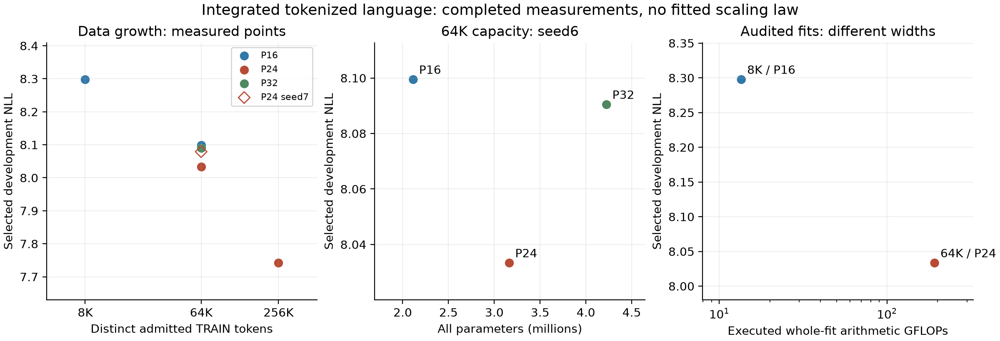

## Appendix. Tokenized256K: bounded learning-rate comparison

P24seed6, same data/source/initialization, 524272fitting targets over two passes,1024updates,four-checkpoint cadence and2040development targets. Only constant learning rate changes; all core mechanisms retained. Public validation untouched. This tuning comparison is separate from the fixed-recipe scaling packet.

| LR | Selected NLL | Selected step | Final NLL | Final − selected | Fit targets |
| --- | --- | --- | --- | --- | --- |
| 0.003 | 7.741714 | 512 | 7.867910 | 0.126195 | 524272 |
| 0.001 | 7.740815 | 512 | 7.801747 | 0.060933 | 524272 |

Lower rate improves selected NLL0.000900 and final NLL0.066162. Both select step512, the first-pass boundary; late deterioration falls0.126195→0.060933. The bounded comparison reduces late deterioration without materially changing selected quality in this seed. Retain the fixed0.003recipe for the crossed scaling comparisons; no expanded rate grid or second-pass cure is inferred.

Both fits charge all524272fitting targets. Actual complete256Kwork is pending for each trajectory; no cost is borrowed from64Kor from the other rate. Ordinary measured throughput384.66/495.85targets/s reflects separate host executions and is not a causal speed effect of learning rate.

## Appendix. Measured language quality, capacity and compute

Sleeping Machines pursues a general-purpose substrate spanning language/reasoning, multimodal world models, embodiment, event-native analytics, continual learning, communication, self-design and hardware. Completed integrated language measurements show quality improving with data and a useful intermediate capacity choice.

P16 selected NLL improves8.297491→8.099440 from8Kto64K TRAINtokens; P24 improves8.033311→7.741714 from64Kto256K. At64K/P24 beats P16/P32 by0.066129/0.057108NLL, seed6. The independent P24seed7point is8.078991. Each plotted point is a completed fit.

Same2040-target DEV population and two-pass fits, initial-inclusive selection; TRAIN frequency prior and checkpoint cadence depend on budget. Seed6 primary; one P24seed7 repeat. Width changes core/input/readout together. No raw points connected or extrapolated. Audited cost points differ in data and width; no iso-quality/iso-FLOP or exponent claim. Arithmetic fit boundary includes discovery/replay/backward/optimizer; special functions separate, random-sampling work unquantified. 256K work absent until an actual audit.

## Appendix. Tokenized language: 256K capacity/data comparisons

Sleeping Machines pursues a general-purpose substrate for language and reasoning, multimodal world models, embodiment, event-native analytics, continual learning, communication, self-design and hardware. This stage measures integrated tokenized learning with more data and capacity.

Seed6, development only. GPT-2 FineWeb: 262,144 admitted training tokens, two passes/524,272 fitting targets, 1024 updates, 2,040 scored development targets. Payload varies; depth2/heads2/pool4, batch64, credit16 and uniform-site K4 actual alternative-write credit are fixed. Every temporal, sparse and persistent-state mechanism is retained. Initialization is eligible for selection, with four evaluation checkpoints over the two passes. Public validation untouched.

| Payload | Initial NLL | Selected NLL | Gain | Selected step |
| --- | --- | --- | --- | --- |
| 24 | 8.078820 | 7.741714 | 0.337106 | 512 |

| Payload | All parameters | Core + input parameters | Readout parameters | Targets/s | RSS KiB |
| --- | --- | --- | --- | --- | --- |
| 24 | 3164842 | 2462880 | 701962 | 384.66 | 500896 |

| Member | Fit targets | Whole-fit GFLOPs | Fit MFLOPs/target | Eval MFLOPs/target |
| --- | --- | --- | --- | --- |
| 24 | 524272 | pending | pending | pending |
| TF head ≥ | 695992320 | ≥161331598.841610 | ≥231.800832 | ≥77.266944 |

TF head ≥ is a source-derived arithmetic lower bound: forward output projection plus its two explicit backward matrix contractions; evaluation has one projection. Width768 and padded50,304classes give231.800832MFLOPs/fitting target and77.266944MFLOPs/evaluation target, at two FLOPs per multiply-add. Other reference computation and optimizer work are excluded. Its695,992,320training targets and public NLL3.2774 use a different data/quality population from these native development fits; these columns show raw work, not a matched-quality or iso-FLOP win. FP8 GPU arithmetic and native CPUfloat32 have different hardware costs.

Work cells require a complete replay with trajectory parity and full arithmetic formula coverage. Fitting includes discovery, actual alternative-write replay, readout, backward, clipping, optimizer and in-step diagnostics; preprocessing, evaluation and serialization are separate. Special functions are counted separately, random sampling work remains unquantified. Pending cells contain no extrapolation from a smaller fit.

All parameters include the token interface and readout; the core/input column includes lexical input parameters. Selected activity remains four writes and sixteen scored keys per token, while vector width grows. Equal data and passes are not equal fitting FLOPs. These ordinary throughput measurements exclude instrumented arithmetic tracing.

The 8K, 64K and 256K stages score the same development population and use two passes. Train-frequency priors and evaluation cadence differ; report absolute loss and within-fit learning separately. The learning gate requires a 0.02 NLL improvement over initialization. No scaling exponent or matched-compute Transformer win is inferred from these cells.

| Payload | Context gain | Memory erase delta | Message erase delta | Both erase delta |
| --- | --- | --- | --- | --- |
| 24 | 0.524467 | 0.019070 | 0.078129 | 0.064475 |

Context gain is constant TRAIN-mean feature NLL minus intact NLL through the same frozen readout. Erasure deltas are intervention NLL minus intact NLL: positive means erasure hurts prediction, negative means it helps. Source, matched-RNG and partition checks pass. The constant-feature control is not an optimally refitted unigram; full-message erasure removes payload, arrival metadata and presence together, changing the normalization branch and read-clock policy. Frozen erasures are not retrained architecture comparisons. The completed payload-only diagnostic is shown separately.

## Appendix. Tokenized language: 64K capacity/data comparisons

Sleeping Machines pursues a general-purpose substrate for language and reasoning, multimodal world models, embodiment, event-native analytics, continual learning, communication, self-design and hardware. This stage measures integrated tokenized learning with more data and capacity.

Seed6, development only. GPT-2 FineWeb: 65,536 admitted training tokens, two passes/131,056 fitting targets, 256 updates, 2,040 scored development targets. Payload varies; depth2/heads2/pool4, batch64, credit16 and uniform-site K4 actual alternative-write credit are fixed. Every temporal, sparse and persistent-state mechanism is retained. Initialization is eligible for selection, with four evaluation checkpoints over the two passes. Public validation untouched.

| Payload | Initial NLL | Selected NLL | Gain | Selected step |
| --- | --- | --- | --- | --- |
| 16 | 8.162280 | 8.099440 | 0.062840 | 128 |
| 24 | 8.162280 | 8.033311 | 0.128969 | 128 |
| 32 | 8.162280 | 8.090419 | 0.071861 | 64 |

| Payload | All parameters | Core + input parameters | Readout parameters | Targets/s | RSS KiB |
| --- | --- | --- | --- | --- | --- |
| 16 | 2115464 | 1631184 | 484280 | 409.80 | 448368 |
| 24 | 3164842 | 2462880 | 701962 | 374.87 | 496232 |
| 32 | 4225420 | 3305328 | 920092 | 343.93 | 546508 |

| Member | Fit targets | Whole-fit GFLOPs | Fit MFLOPs/target | Eval MFLOPs/target |
| --- | --- | --- | --- | --- |
| 16 | 131056 | pending | pending | pending |
| 24 | 131056 | 192.211765 | 1.466638 | 0.403428 |
| 32 | 131056 | pending | pending | pending |
| TF head ≥ | 695992320 | ≥161331598.841610 | ≥231.800832 | ≥77.266944 |

TF head ≥ is a source-derived arithmetic lower bound: forward output projection plus its two explicit backward matrix contractions; evaluation has one projection. Width768 and padded50,304classes give231.800832MFLOPs/fitting target and77.266944MFLOPs/evaluation target, at two FLOPs per multiply-add. Other reference computation and optimizer work are excluded. Its695,992,320training targets and public NLL3.2774 use a different data/quality population from these native development fits; these columns show raw work, not a matched-quality or iso-FLOP win. FP8 GPU arithmetic and native CPUfloat32 have different hardware costs.

Work cells require a complete replay with trajectory parity and full arithmetic formula coverage. Fitting includes discovery, actual alternative-write replay, readout, backward, clipping, optimizer and in-step diagnostics; preprocessing, evaluation and serialization are separate. Special functions are counted separately, random sampling work remains unquantified. Pending cells contain no extrapolation from a smaller fit.

All parameters include the token interface and readout; the core/input column includes lexical input parameters. Selected activity remains four writes and sixteen scored keys per token, while vector width grows. Equal data and passes are not equal fitting FLOPs. These ordinary throughput measurements exclude instrumented arithmetic tracing.

The 8K, 64K and 256K stages score the same development population and use two passes. Train-frequency priors and evaluation cadence differ; report absolute loss and within-fit learning separately. The learning gate requires a 0.02 NLL improvement over initialization. No scaling exponent or matched-compute Transformer win is inferred from these cells.

| Payload | Context gain | Memory erase delta | Message erase delta | Both erase delta |
| --- | --- | --- | --- | --- |
| 16 | 0.208993 | 0.006892 | -0.024694 | -0.028288 |
| 24 | 0.252343 | 0.007313 | 0.022623 | 0.014234 |
| 32 | 0.166731 | 0.002895 | -0.009512 | -0.011456 |

Context gain is constant TRAIN-mean feature NLL minus intact NLL through the same frozen readout. Erasure deltas are intervention NLL minus intact NLL: positive means erasure hurts prediction, negative means it helps. Source, matched-RNG and partition checks pass. The constant-feature control is not an optimally refitted unigram; full-message erasure removes payload, arrival metadata and presence together, changing the normalization branch and read-clock policy. Frozen erasures are not retrained architecture comparisons. The completed payload-only diagnostic is shown separately.

## Appendix. Independent seed for selected 64K capacity

Payload24, selected from the three completed seed6 capacity fits. Seeds6/7 share GPT-2 FineWeb, 65,536 admitted training tokens, 131,056 fitting targets/two passes and 2,040 development targets; initialization-inclusive selection every64 updates. Public validation untouched.

| Seed | Initial NLL | Selected NLL | Gain | Selected step |
| --- | --- | --- | --- | --- |
| 6 | 8.162280 | 8.033311 | 0.128969 | 128 |
| 7 | 8.162280 | 8.078991 | 0.083288 | 128 |

This repeat measures selected-member learning reliability and seed variation. The quality gain over P16 is a seed6 capacity comparison; it is not a paired two-seed capacity win.

| Context gain | Memory erase delta | Message erase delta | Both erase delta |
| --- | --- | --- | --- |
| 0.234159 | 0.005551 | -0.032675 | -0.039134 |

Frozen interventions use the same readout and matched RNG, with intact partition parity. Positive erasure delta means the intervention hurts prediction. Full-message erasure bundles payload, arrival metadata and presence, including changes to normalization and the read clock. Constant TRAIN-mean features are not an optimally refitted unigram; no retrained ablation claim.

## Appendix. Tokenized messages: replicated payload contribution

P24 selected64Kcheckpoints, two seeds, 2,040development targets. Erasure delta is intervention NLL minus intact NLL. Payload-only erasure hurts prediction in both seeds by0.105206/0.101270NLL; the message information path contributes under this intervention.

| Seed | Intact NLL | Payload erase delta | Full message erase delta |
| --- | --- | --- | --- |
| 6 | 8.033311 | 0.105206 | 0.022621 |
| 7 | 8.078991 | 0.101270 | -0.032673 |

Frozen selected checkpoints, development only. Payload intervention zeros ctx_vals while preserving ctx_arr and has_ctx before each event; full-message intervention zeros all three. Payload intervention preserves the normalization branch and incoming arrival metadata at that event, but future routes/timing/states can change. Matched route RNG and intact chunk-partition/selected-score parity. Neither intervention is a retrained architecture or a causal decomposition of total gains.

## Appendix. Tokenized8K: replicated learning and memory-use decisions

Sleeping Machines pursues a general-purpose substrate for language and reasoning, multimodal world models, embodiment, event-native analytics, continual learning, communication, self-design and hardware. This integrated stage advances the Transformer-leading language program; tiny fits are engineering diagnostics.

Both horizons beat initialization in both seeds. GPT-2 FineWeb:8192admitted training tokens,16368fitting target presentations/two passes,32AdamWupdates,2040development targets. P16/D2/H2/U4,batch64; credit16/64 share data/updates/cadence. Initial-inclusive development selection every8updates; public validation untouched. Four selected writes,16scored keys and256persistent memory scalars per lane. The bounded local fits preserve the immutable AWSqueues.

| Seed | Credit | Initial NLL | Selected NLL | Gain | Context gain | Memory gain |
| --- | --- | --- | --- | --- | --- | --- |
| 6 | 16 | 8.340313 | 8.297491 | 0.042822 | 0.017759 | 0.000381 |
| 6 | 64 | 8.340313 | 8.300131 | 0.040182 | 0.001898 | -0.000268 |
| 7 | 16 | 8.340313 | 8.286427 | 0.053886 | 0.027515 | 0.000980 |
| 7 | 64 | 8.340313 | 8.290236 | 0.050078 | 0.017711 | 0.000449 |

Credit16mean selected8.291959 beats credit64mean8.295183, and is better in both paired seeds; the0.003224mean gap is smaller than seed spread. Ordinary measured fitting throughput is395–422targets/s, peakRSS452456–453252KiB. Retain both completed records. Numeric state carries across credit boundaries; truncating derivatives does not reset state.

Context gain uses the same frozen readout with a constant mean of8184causal TRAINfeatures. Memory gain is NLL after per-token addressed-state/arrival/seen erasure minus intact NLL; negative means the intervention improves loss. Recurrent-message erasure costs0.017843–0.021955NLL. Matched route RNG, source binding and token partition parity pass. These are frozen interventions, not retrained ablations; the constant-feature control is not an optimally refitted unigram.

| Alternative | Seed | Selected NLL | Gain vs credit16 | Parameters |
| --- | --- | --- | --- | --- |
| Full-width tails | 6 | 8.302969 | -0.005478 | 3292836 |
| Memory gain2 | 6 | 8.310055 | -0.012563 | 2115464 |
| Full-width tails | 7 | 8.286345 | 0.000082 | 3292836 |

Full-width decoder tails lose at seed6 and are effectively tied at seed7. Retain the narrower decoder. First-tail training exposure is695targets/data pass, so this comparison exercises learned tail projections. The memory-gain intervention doubles the existing unit output contribution while preserving all temporal/state/routing/learning mechanisms and parameter count; it is selected only from completed fits. See TOKEN_MEMORY_COUPLING_20261005.md for derivation and contracts.

| Member | Fit targets | Whole fit GFLOPs | Fit MFLOPs/target | Eval MFLOPs/target |
| --- | --- | --- | --- | --- |
| Credit16seed6 | 16368 | 13.534669 | 0.826898 | 0.272633 |
| Credit64seed6 | 16368 | pending | pending | pending |
| TF head ≥ | 695992320 | ≥161331598.841610 | ≥231.800832 | ≥77.266944 |

TF head ≥ is a source-derived arithmetic lower bound: forward output projection plus its two explicit backward matrix contractions; evaluation has one projection. Width768 and padded50,304classes give231.800832MFLOPs/fitting target and77.266944MFLOPs/evaluation target, at two FLOPs per multiply-add. Other reference computation and optimizer work are excluded. Its695,992,320training targets and public NLL3.2774 use a different data/quality population from these native development fits; these columns show raw work, not a matched-quality or iso-FLOP win. FP8 GPU arithmetic and native CPUfloat32 have different hardware costs.

Actual whole-fit traces must reproduce each control trajectory. Arithmetic includes factual computation, all-key discovery, suffix replay, exact target readout, backward, clipping, optimizer and in-step diagnostics; initialization/frequency counting,evaluation and serialization excluded. Special functions separate; random-sampling work unquantified. Evaluation includes scorer reductions. Pending cells contain no predicted work or quality. Equal updates/data here are not an iso-FLOP claim. Selected Transformer-reference quality and resource protocol remains the larger benchmark target.

## Appendix. Language strengths: measured decisions and complete work

The target data region deliberately favors strong Transformer references over LSTMs; tiny native fits diagnose learning before that larger comparison. The native construction chooses temporal computation, persistent memory lifetime and sparse addressed activity independently of Transformer topology or fixed windows. Matched-history and longer-native-history comparisons are labelled separately; causal inputs and scored targets stay explicit. Capacity beyond activity earns promotion through better held-out prediction with discovery and learning fully charged.

Controlled learning-rate test: seed6, GPT-2 FineWeb2K, P16/D2/H2/U4, batch64/credit64, uniform K4 actual alternative-write utility,16updates and1,016development targets. Initial weights eligible. Lower learning rate loses selected quality by0.046604NLL; retain .003. Its better final loss does not replace the better selected incumbent. These are development comparisons.

| Recipe | Selected NLL | Final NLL | Fit targets | Targets/s | RSS KiB |
| --- | --- | --- | --- | --- | --- |
| Retained lr .003 | 8.819470 | 9.111889 | 8160 | 404.6 | 451728 |
| Alternative lr .001 | 8.866074 | 8.866074 | 8160 | 423.2 | 451308 |

Decoder exposure uses train-only frequency rank and eight contiguous lanes. At2K every target reaches the head: identical default/full-width development curves do not test learned tail rank. The existing8Kcomparison reaches the first tail. Branch counts below are targets per data pass; head cutoff2,000, tail boundaries10,000/30,000/50,257.

| Train tokens | Distinct | Head | Tail1 | Tail2 | Tail3 |
| --- | --- | --- | --- | --- | --- |
| 2048 | 796 | 2040 | 0 | 0 | 0 |
| 8192 | 2696 | 7489 | 695 | 0 | 0 |
| 32768 | 6778 | 26915 | 5845 | 0 | 0 |
| 65536 | 10914 | 51272 | 13343 | 913 | 0 |
| 262144 | 23144 | 196953 | 47809 | 17374 | 0 |

Actual native work: multiply-add=2FLOPs; arithmetic excludes separately counted special functions and unquantified random sampling. Whole fitting includes factual core, all-key scoring, alternative discovery, suffix replay, exact readout, backward, clipping, optimizer and in-step diagnostics. Initialization/frequency counts, evaluation and serialization are outside that fitting column. Selected evaluation includes scorer reductions, with no gradient/optimizer. Audit instrumentation wall time is not ordinary throughput. Public Transformer work remains in its separate audited protocol; no matched-compute win is inferred here.

| Boundary | Targets | Total GFLOPs | MFLOPs/target | Coverage |
| --- | --- | --- | --- | --- |
| Whole fit | 8160 | 6.183337 | 0.757762 | complete |
| Selected evaluation | 1016 | 0.296939 | 0.292263 | complete |

Next: existing AWS8Kpaired seeds/horizons, trained memory utility, informative decoder comparison, then measured width/data and fixed-activity pool scaling. Public validation remains reserved. See experiments/TOKEN_STRENGTH_EXECUTION_20261005.md for the ordered strength tests.

## Appendix. Tokenized language: confirmed small-fit learning

Sleeping Machines pursues a general-purpose substrate for language and reasoning, multimodal world models, embodiment, event-native analytics, continual learning, communication, self-design and hardware. These diagnostics select constructions within that family.

Both integrated members beat initialization in both seeds. GPT-2 FineWeb:2,048 admitted training tokens,8,160 training targets over four passes and16updates,1,016 scored development targets. Optimizer batch64 per lane; credit16/64 share data, updates and evaluation cadence. Natural-log NLL, lower is better; initialization is eligible for selection. Public validation is reserved.

| Seed | Credit | Initial dev | Selected dev | Gain | Context gain |
| --- | --- | --- | --- | --- | --- |
| 6 | 16 | 8.906910 | 8.812527 | 0.094383 | 0.005029 |
| 6 | 64 | 8.906910 | 8.819470 | 0.087440 | 0.015265 |
| 7 | 16 | 8.906910 | 8.813838 | 0.093072 | 0.011278 |
| 7 | 64 | 8.906910 | 8.812853 | 0.094057 | 0.011398 |

Context gain compares actual features with constant mean causal TRAIN features through the same frozen learned readout. All four contributions are positive. This intervention does not isolate persistent memory from current-token features or refit an optimal unigram control. Much of the total gain is marginal recalibration.

Frozen history interventions: erasing the recurrent event message worsens NLL0.04618–0.06734 across all four checkpoints; erasing addressed memory changes it by−0.001080 to+0.001388. Matched RNG and intact partition parity pass. Messages can carry multi-event history. These out-of-distribution interventions target addressed-memory utilization for diagnosis; they are not retrained ablations.

Credit16 wins selected quality at seed6; credit64 wins at seed7 and has better final loss in both seeds. Retain both for the matched AWS8K comparison. Changing optimizer batch16 to64 also reduced updates64 to16 at equal targets: a recipe improvement, not an isolated horizon effect.

P16/D2/H2/U4 supplies256 persistent memory scalars per lane, four selected writes and16 scored keys per target. Mechanisms include race clocks, addressed persistent state, separate keys/values, small messages, depth and actual counterfactual write credit. Decoder rank and credit boundaries are selectable design choices. These are confirmed development learning gains; the public benchmark comparison is the next larger test.

## Appendix. Tokenized language: integrated learning development

Sleeping Machines pursues a general-purpose substrate for language and reasoning, multimodal world models, embodiment, event-native analytics, continual learning, communication, self-design and hardware. These language diagnostics test constructions within that family.

Historical optimizer-batch16 recipe, seed6; GPT-2 FineWeb; 2,048 admitted training tokens, 8,160 presented targets over64updates, 1,024 development tokens yielding1,016 scored targets after8lane starts. Earlier notes called these1,024targets; saved losses are unchanged. P16/D2/H2/U4:256persistent memory scalars per lane, four selected writes and16scored keys per target. Public validation remains reserved. Loss is natural-log NLL; lower is better. Throughput includes training work, excludes evaluation.

| Member | Initial dev | Best trained dev | Final dev | Targets/s |
| --- | --- | --- | --- | --- |
| Local value | 8.906910 | 9.131615 | 9.888922 | 404.09 |
| First-site full suffix | 8.906910 | 9.130419 | 9.865284 | 342.83 |
| First-site K4 suffix | 8.906910 | 9.130868 | 9.844923 | 351.84 |
| Uniform-site K4 suffix | 8.906910 | 9.063122 | 10.354817 | 386.82 |

Uniform-site K4 wins the trained development comparison against first-site K4 by0.067745NLL, single seed at equal data/presentations. It combines broader site exposure, utility weighting and removal of immediate-only route credit.

All trained members in this historical batch16 recipe lose to initialization. Uniform-site late dev10.354817 loses to first-site K4late9.844873. Initial weights now remain eligible for selection; historical trained-only fields stay preserved with the correction beside them.

Mechanisms: persistent state, race clocks/transport, sparse hard writes, separate selection/value roles, small messages, depth and actual counterfactual writes. Credit remains chunk-bounded; all keys are scored. The uniform-site learner uses winner-only factual/replay proposals. Memory occupancy alone is not predictive capacity.

## Appendix. Tokenized complete work and scaling prerequisites

Synthetic P16/D2/H2/U4/B8/T16, vocabulary50,257; all adaptive tails exercised, first AdamW update. Arithmetic includes factual computation, readout, alternative sampling, replay, backward, clipping and optimizer. Special functions have a separate ledger; random sampling work is unquantified. These are executed steps, not whole-fit extrapolations or hardware energy.

| Scoring | Targets | Step MFLOPs | MFLOPs/target |
| --- | --- | --- | --- |
| Full scoring | 128 | 253.930317 | 1.983831 |
| K4 scoring | 128 | 218.255413 | 1.705120 |

K4 arithmetic is14.05%lower in this realization. Replay readout falls47.286432to12.713512MFLOPs. This table is a synthetic first-update diagnostic. Completed actual-corpus8K/P16 and64K/P24whole-fit/inference traces now appear above, with exact trajectory parity and complete arithmetic coverage. The256Kwhole-fit trace is pending; no smaller-fit extrapolation fills it.

Exact actual-driver interruption/resume passed for integrated, sampled-position and uniform-site learners, including all relevant RNGs. Full-score sampled learning equals the original trajectory. Wider decoder tails preserve normalization and initial token priors; default parameterized learning parity and full-width resume passed.

The public reference target reuses the modded-nanoGPT2025-01-26log:3.2774NLL,695,992,320training presentations,10,485,760reserved validation targets. That protocol/context differs from these development rows. EOS/reset/target and layered attention boundaries are source-audited; historical data hashes are absent and no checkpoint is released by this record. No dense reference is retrained.

Prepared AWS8K comparisons remain unrun here, with AWS admission/results unobserved. Completed local paired8Kfits retained credit16 and narrower tails; the64Kcapacity comparison selected P24, followed by the completed256Kfit. Measured-data visualization and source-bound whole-fit costs appear above. The next language fit tests lower learning rate after repeated second-pass deterioration; fixed-recipe scaling and recipe repair stay separate.

## Completed private-bank8K exposure pair — 6 October

Receipt `experiments/results/diagnostics/aws_private_bank_8k_completed_pair_20261006T002600Z.json` binds fits, selection, utility and work inputs. One paired seed6,8192GPT-2TRAINtokens/two passes,16368fitting targets,2040DEVtargets. Both complete-work replays have exact final numerical training state and zero DEV-curve error.

| Bank | Selected DEV NLL | Whole-fit arithmetic GFLOPs | Fitting MFLOPs/target | Inference MFLOPs/target | State scalars/lane | Scored keys/token | Selected writes/token |
|---|---:|---:|---:|---:|---:|---:|---:|
| U4 |8.274547143|21.017907004|1.284085228|0.409690078|384|16|4|
| U16 |8.267437864|21.626956732|1.321295011|0.415837466|1536|64|4|

U16 quality point win0.007109279NLL; whole-fit arithmetic+2.8978%,inference+1.5005%; no Pareto win. Entire two-pass fitting work charged; special functions separate and random work unquantified. Context utility now positive0.027648926/0.035558701NLL(U4/U16). Addressed-memory erase−0.000387592/−0.000237985still improves NLL; useful addressed memory is the next measured target. Fullmessage erase+0.038303459/+0.039863149 includes normalization/clock metadata changes. Preserve failed2Kutility evidence alongside this result.

Declared scaling planner passes actual future-credit logs, complete work and context gates. Prepared64K P24/D2/H2,U4/U16,seeds6/7,two passes131056fitting targets,256updates/every64DEV. Measured ordinary throughput/RSS yields U4:415s/917504KiBRSS; U16:424s/983040KiBRSS;5GBVMS/8GiBfloor. This receipt prepares reservations; unique source/data-bound scheduler packets and currenthostcheck must admit execution. No public Transformer score or confirmed capacity advantage claimed.
