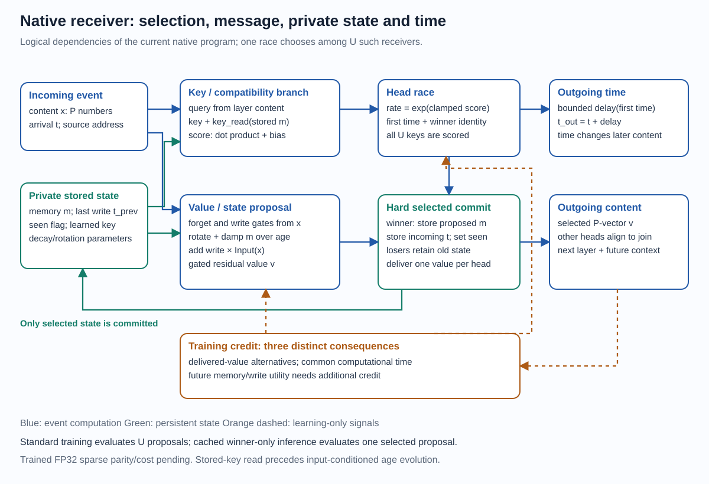
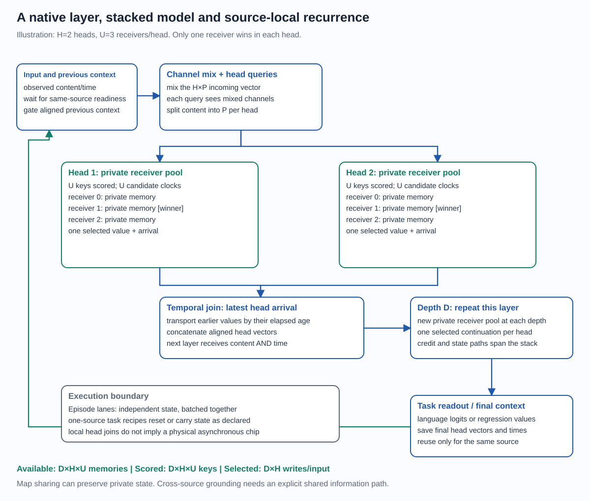
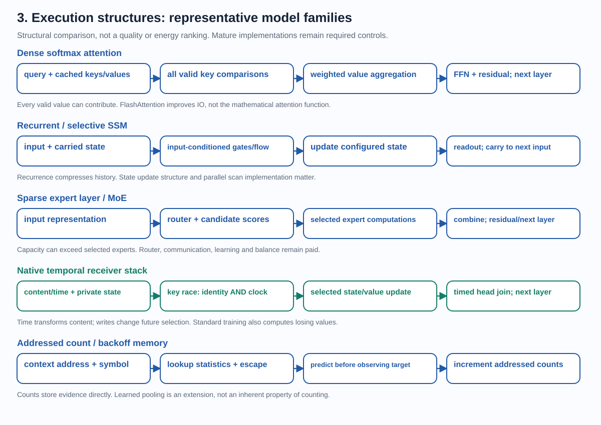

# Architecture review: primitives, composition and capability

4 October 2026. This review describes the implemented family and separates
algebraic identities, scoped measurements, prototypes and open hypotheses.
It is not a public benchmark or patent-novelty claim. The core research target
remains temporal computation, sparse events, persistent state and useful credit
to unrealized alternatives, with capacity exceeding selected work.

The bird's-eye progression is manifesto → scoped constructions/experiments →
defined family and design rationale → integrated validation/scaling. This
review organizes tested parts and possible compositions around that original
motivation; it does not merge separate successes into one completed system.

[Start with the family definition and design rationale](model_family_design.md) ·
[Interactive architecture atlas](architecture_atlas.html) ·
[Whole-family inventory](model_family_inventory.md) ·
[Detailed bounds and review corrections](../experiments/theory/152_primitives_integration_and_capability_bounds.md)

The family definition precedes the implementation catalogue: choose compatible
state programs, temporal/routing/reception policies and learning mechanisms at
each level. Richer operators can be used at the limiting layer while others
remain selective. Exact operator containment, trained performance and total-cost
advantage are three separate claims. The [design rationale](model_family_design.md)
states the conditions for matching counts, supported SSMs, gated recurrence,
attention, Transformer blocks and expert routing.

Synchronous schedules and full-support dense execution are allowed endpoints
of the general event/support design space. They need actual snapshot/barrier
and aggregation contracts: equal timestamps or a larger winner pool alone are
insufficient. Function, execution and learning containment are distinguished.

No global periodic update clock is required by the architectural semantics.
Local races, joins, causal timestamps and deadlines remain meaningful; current
CPU/GPU and optimizer execution is clocked/coordinated. Dense/sparse inputs,
computation density, arrival synchrony and hardware clocking are independent.
Their single-model integration requires an explicit shared information path,
not just shared parameters; joint multimodal training remains open.

The receiver and stack diagrams below illustrate one important native branch.
The family map and inventory cover the timing-logic, statistical, carrier,
SSM-like, native, episodic, protected-outcome, count/statistic hybrid, attention
bridge, reception and learning/execution branches. They are not all a single
tested configuration. Every level is reviewed on computational capacity,
representational capacity and trainability in the family inventory and atlas.

## Review structure across the whole family

The central idea is to **learn reusable operations while storing and consulting
evidence selectively**. Timing determines when evidence meets and how content
changes; keys determine which evidence/program participates; persistent state
retains facts; counterfactual learning teaches choices that did not execute.
Counts, learned vectors and historical records are different ways to retain
evidence within this toolbox. Their best combination depends on the task.

For a first read, use the design rationale, the unit-type table and the integration
examples below. The native unit/stack expands one implemented construction.
The inventory contains every branch and design choice; the theory note gives
the mathematical bounds and assumptions. The atlas illustrates both family
structure and the difference between available capacity and selected work.

| Level | Computational capacity / cost | Representational capacity | Trainability |
| --- | --- | --- | --- |
| Events and primitives | Causal arrivals, temporal algebra and local operations | Content, order, intervals, address and precision | Information retention and correct time/event derivatives |
| Units | Logic, statistics, modal state or nonlinear local programs | A unit's state and temporal response | Local parameters, content/state credit, discrete support |
| Modules | Races, memory access, accumulation, reception and query | Conditional choice and accessible evidence | Candidate coverage, branch utility, exposure and conditioning |
| Interactions / layers | Mixing, timed joins, writes and cross-module dependencies | Joint features, noncommuting order and time/content coupling | Actual coupled Jacobians, boundaries and useful finite updates |
| Stacks | Serial transformations with persistent recurrence | Hierarchical temporal functions and distributed state | Deep support, stable information paths, useful depth and horizon |
| Compositions | Stack plus count/KV/outcome memory and readout | Statistics, abstraction and nonlocal evidence together | Responsibility, future writes, retrieval and old producer credit |
| Systems | Admission, objectives, optimizer, scheduling and serving | Capability under actual resource and information limits | Reproducible quality, transfer, online stability and complete cost |

The [family inventory](model_family_inventory.md) applies these axes to every
architectural branch, records mechanism coverage and explains each design
choice's benefit and price. It also distinguishes learned parameter knowledge,
persistent facts and explicit statistics. The [source map](architecture_source_inventory.md)
navigates all110reviewed module/driver records without importing any model.

## Unit level: several different component types

| Unit type in the family | State and computation | Representation | Learning boundary |
| --- | --- | --- | --- |
| Timing-logic unit | Spike/hold/reference state; delay, first-of, coincidence or veto | Temporal predicates and selected continuations | Route/timing credit; changing event support is discrete |
| Statistical receiver | Symbol counters, occupancy and escape/backoff metadata | Repeated empirical evidence and smoothed distributions | Exact increments; learned smoothing/router needs separate credit |
| Modal event-state unit | Signed real pairs, analytic flow and event injection | Exponential filters, phase and elapsed-time features | Exact supported affine derivatives; optional route boundaries separate |
| Nonlinear private receiver | Stored vector, key/value/control maps, residual output and race | Stateful conditional temporal programs | Current value credit plus incomplete general future-write utility |
| Historical memory item | Stored key/value or protected outcome with age/address | A retrievable fact or representation | Current read maps versus detached historical producer credit |
| Window / silence receiver | Moments/expiry or accumulator/deadline | Integrated evidence, grouping and absence | Fixed-history derivatives versus membership/merge/split utility |

The diagram below expands the **nonlinear private receiver**, one central
family member. Its particular gates, clamp and bounded delay are not definitions
of every possible event unit in the broader toolbox.

An event carries an observed source, arrival time and a small content vector.
A receiver stores a vector memory, its last write time, learned keys, a
memory-to-key map, input/output maps, gates, decay rates and rotation frequencies.
Keys decide participation; values carry the result. Their different roles let
the model change retrieval compatibility without forcing identical changes to
the delivered representation, although both depend on shared memory/content.

Addressing is a design choice across the family. Some older language receivers
are indexed by the current character; `NativeStreamLanguageModel` and current
episode task recipes instead use one shared source with character/content
vectors. `AddressedEventHeads` supports several observed sources with separate
state. These choices change which evidence can meet, and are not interchangeable
merely because their local receiver algebra is similar.

The current native receiver computes compatibility from the **stored memory**:
`score = query · (key + key_read(memory)) / sqrt(P) + clock_bias`, then clamps
the score to [-12,12]. At proposal time it computes input-conditioned forget
and write gates, applies damped rotation over the elapsed age, adds a projected
incoming vector, and emits a gated residual vector. A race selects one proposal
and one private memory commit per head. The write timestamp is the incoming
arrival, while the outgoing event arrives after the computational delay.

The input-conditioned forget factor uses the current input over the past age.
This is the actual reference program; it should not be mistaken for an
autonomous fixed-parameter physical flow throughout that past interval. The
separate inter-head message transport uses its own fixed learned damped rotation.

The main batched training evaluator computes **every admitted proposal** and
then commits only the winners. Cached winner-only inference computes selected
proposals after scoring keys; completed-model FP32 state/cache/quality parity
and serving measurements remain separate pending gates. Sampled-alternative
training is another implemented path, not the default completed dense-proposal
recipe. Optimizer steps and numerical emulation are presently conventional.

Reference code: [receiver](../sleeping_machines/sparse_race_language.py),
[addressed heads](../sleeping_machines/addressed_event_heads.py),
[batched learner](../sleeping_machines/batched_episodes.py),
[winner-only inference](../sleeping_machines/sparse_inference.py),
[sampled-alternative training](../sleeping_machines/sparse_training.py).

## A layer and a composed native model

At each depth a learned channel mixer processes the incoming H×P vector.
Each of H heads computes a query from that mixed vector and scores its own
pool of U receivers. Each head races independently, delivers one P-vector and
updates one receiver. Head messages can arrive at different times. The layer
joins at the **latest head arrival**, transports earlier messages to that
time by learned damping/rotation, concatenates them, and feeds the next layer.
Thus a layer has temporal interaction and a local join; its CPU execution is
not a physically parallel asynchronous circuit.

The final head messages and arrival times become source-local context for
the next input. That input waits until its own previous context is ready,
aligns the context and mixes it through a learned gate. Other observed source
addresses have distinct persistent state. The episode-batched implementation
used by current task drivers uses one source and independent episode lanes;
it is not a complete shared-state multimodal agent or a cross-source message
scheduler. Joint grounding requires an explicit information path and training.

For D layers, H heads and U receivers/head/source:

| Quantity per input, one source | Amount | Meaning |
| --- | ---: | --- |
| Available receiver memories | D×H×U | Private state capacity |
| Scored candidate keys | D×H×U | Current full-pool discovery work |
| Selected receiver commits | D×H | Sparse state updates |
| Selected head deliveries | D×H | One value/head/layer |
| Proposed receiver values, standard training | D×H×U | Losing-value learning work is paid |
| Proposed values, winner-only inference | D×H | Cache/stack/setup and all-key scoring remain |

For example, D4/H2/U4/P32 has 32 receiver memories and eight selected commits
per input. It does not have constant total cost when U grows. Tied-pool models
share processing maps while retaining private keys, clock parameters, timescales
and memories; tying maps does not tie the stored evidence.

## The primitive inventory

| Primitive | Computational role | Expressivity and trainability | Present status |
| --- | --- | --- | --- |
| Learned delay and temporal race | Selects an addressed continuation; exposes identity and first time | Exact softmax categorical probabilities; first time also carries total rate. Hard choices need alternative utility credit. | Integrated; local surrogate and replay variants have different guarantees |
| Damped rotation and timed transport | Changes a vector using elapsed time without numerical idle ticks | Exponential filters, oscillatory phases, interval-sensitive features; differentiable within a fixed history | Integrated; physical implementation unmeasured |
| Gated private state commit | Mixes new evidence with addressed memory | Persistent, nonlinear sequence computation; commits alter future keys, clocks and values | Integrated; general future-write credit remains incomplete |
| Separate query/key/value retrieval | Finds prior evidence by content and interprets it at read time | Associative recall; historical capacity distinct from current activity | Implemented in family; no per-position KV bank in current native core |
| Temporal pooling and coincidence | Receives more than one message | Smooth compact windows; finite-timeout options; interactions depend on received messages | Reference primitives/contracts; not a completed integrated reception-window learner |
| Silence deadline / popcorn burst | Emits after no arrival for a chosen duration | Computes grouping and absence information; merge/split boundaries require discrete outcome credit | Causal reference implemented; whole native scheduler/training pending |
| Statistic-valued addressed memory and escape | Accumulates repeated evidence and backs off when evidence is sparse | Exact count estimators and smoothed prediction; cheap conditional alternative losses | Causal statistical models completed; learned statistic-valued integration has implementations/small fits, not established scaling |
| Counterfactual utility and credit | Changes which programs will be recruited | Clock, delivered-value, write, timing, silence and continuation alternatives are distinct | Value credit helps language; exact bounded replay and failed write surrogates retained |

These are **candidate contributions in combination**. Delay learning, event
gradients, sparse experts, SSMs, Bayesian counts and content-addressed memory
all have prior art. No absence-of-prior-art claim follows from this review.

## What integration adds

Time and content form a feedback chain: content changes a score; that changes
a route and a delay; elapsed time changes the transported vector; the winner
changes private memory; that memory changes later scores and future values.
Consequently a representational update can also change the computation graph.
Conversely, routing can recruit a different representation and retention rule.

This has four potentially useful consequences:

1. **Conditional temporal programs.** A match recruits not only a value but a
   stateful program with its own forgetting, writing and timing. This can use
   the same compatibility work for several task-relevant transformations.
2. **Shared rules, private evidence.** Processing maps can learn from many
   receivers while each receiver stores different facts. Larger state need
   not mean a proportionally larger learned matrix bank.
3. **Sufficient statistics plus abstraction.** Counts preserve well-supported
   details; learned representations can pool unfamiliar contexts or implement
   nonlocal relations. The mixture must give the learned part useful exposure
   and an information path to the evidence it must complement.
4. **Inference/learning separation.** One hard continuation can execute at
inference while training examines additional possible continuations. The
   useful objective is quality per *total* discovery, teaching and execution
   work, not merely per selected event.

These are capabilities of a construction, not automatic improvements. Temporal
nonlinearities can amplify noise; private state can be inaccessible; shared
parameters can receive conflicting updates; counterfactuals can be inaccurate
or beyond the credit horizon. More routes do not create information that the
input adapter discarded, and more state does not make that state learnable.

## Routing is several distinct decisions

| Decision | What chooses it? | What it changes | Learning / cost boundary |
| --- | --- | --- | --- |
| Source/state address | Observed ID, token/context rule, fixed hash or explicit learned address, depending on branch | Which state can be read/written at all | Fixed IDs/hashes are not learned discovery; lost cross-source access needs an explicit connection |
| Candidate discovery | Pool membership, inverted/content index or shortlist | Which alternatives are admitted | Index/search work and recall; an excluded useful route cannot receive ordinary local credit |
| Winner or expert choice | Key/query scores, computational clocks or deterministic variant | Which program/value/private write executes | Scores, clock precision, proposal utility and exposure |
| Temporal order / reception | Delays, head arrivals, windows, holds and silence deadlines | Which messages meet, integrate, trigger or expire | Timing derivatives within a history; separate merge/split/birth/cancellation credit |
| Continuation / computation budget | Fixed stack or optional branch/stopping policy | How much future work and which transformations occur | Actual suffix utility, latency/resource objective and complete policy support |

Changing representation content can change all learned decisions downstream.
Changing a route can change the represented evidence and future decisions.
Separate key/value maps, offsets and alternating updates provide degrees of
freedom within this coupled computation; they do not make its dependencies
disappear. A local branch teacher must name the consequences it actually credits.

A further ambition is to learn family-level design choices from data inside
the model: operator type, reception fan-in, optional depth and state allocation.
This goes beyond the already learned event-level routes in a fixed containing
pool/stack. The [design rationale](model_family_design.md) specifies nested
changes, task/resource utility, compatible state migration and credit scope.
General learned graph morphing remains a direction, not a completed benchmark.

## Composition is more than stacking layers

| Composition | Computation | New representational opportunity | Training requirement |
| --- | --- | --- | --- |
| Serial layers | Feed timed content through successive transformations | Hierarchical features; noncommuting order-dependent programs | Stable information/credit paths and useful extra depth |
| Parallel heads / branches | Compute several responses and join/aggregate | Complementary views, several retrieved facts and joint features | Join timing, branch usefulness, mixing and total branch work |
| Recurrence / private state | Let an event change what later events encounter | Persistent facts and multi-timescale contextual rules | Credit to old writers, retained information and controlled overwrite |
| Stack plus KV/outcome memory | Retrieve historical evidence when needed | Nonlocal binding beyond a compressed recurrent summary | Candidate recall, actual read/write utility and historical-producer scope |
| Learned predictor plus statistics | Combine abstractions with count/escape evidence | Frequent detail plus sharing across unfamiliar contexts | Proper predictive mixture, information access and enough base responsibility |
| Temporal pooling / timeout layer | Aggregate arrivals or emit after silence | Grouping, absence and several interacting messages | Causal deadlines and correct support/boundary utility |
| Query/readout composition | Affine, bilinear, polynomial, categorical, hazard or regression output | Which retained distinctions become observable predictions | Conditioning, calibration, target information and decoder generalization |

A parallel residual extension is not automatically additional serial depth.
Packed state or a compiler change does not automatically increase expressivity.
A larger decoder does not prove the encoder learned new useful features.
These distinctions prevent benefits from being assigned to the wrong level.

## Objectives and the complete learning system

The event prefix defines what the predictor observes; the query defines when
a prediction is requested. Its observation cutoff and its computation
completion time are different. The family includes categorical next-symbol or
class loss, regression, proper prefix objectives and a marked-hazard likelihood.
For event intensity lambda_y(t), that likelihood includes both an event term
and integrated intensity during observed silence. Silence can carry evidence
even when there is no new input message; a clock/deadline/query supplies the
causal observation. A stream ending in a file must not retroactively flush a
burst before its true timeout.

Targets, next-event exposure and future stream duration belong to labels or
declared observation boundaries, not hidden predictive features. The current
one-source receiver does not automatically schedule every autonomous threshold,
silence deadline or online stopping query; those interfaces require explicit
implementation and contracts. See [objectives](../sleeping_machines/objectives.py),
[prefix queries](../sleeping_machines/event_query.py) and
[burst semantics](../sleeping_machines/silence_burst.py).

Credit travels through a particular retained graph or replay horizon; an
optimizer transforms it into an actual finite parameter update. Training must
account for candidate search, losing proposals/returns, backward, clipping,
optimizer state and communication as well as the sparse committed forward path.
At deployment distinguish fixed weights with state updates, count adaptation,
parameter learning, and changes to cached weight versions. A stable local
primitive alone does not establish a stable complete online-learning system.

The same model's units/maps/state can continue learning online, including
native TTT from observed/self-supervised outcomes. Learning can be streamed,
locally scheduled or batched; sparse proposals do not imply sparse key or
optimizer updates. The [family design rationale](model_family_design.md)
specifies adaptation levels, causal predict/observe/learn order, ownership and
version requirements, and the difference between supported structure and a
completed TTT-quality result. Current batched clipping/Adam is coordinated;
fully asynchronous on-chip training remains unmeasured.

## Where the candidate advantage lives

The distinctive construction combines **time-based transforms and decisions,
small learned content, private persistent evidence, selective execution and
learning from unrealized stateful alternatives**. Each contributes a different
potential saving or capability. Their joint behavior must earn its advantage.

| Opportunity | Why it is plausible | What must be demonstrated |
| --- | --- | --- |
| Useful state grows faster than expensive active maps | Shared rules can operate on many distinct private facts | Prediction improves with state capacity at a counted discovery/training/serving budget |
| Temporal operations reduce explicit repeated computation | Analytic flow, delays and reused matches generate different responses | Equivalent useful transformations with adequate precision and lower complete resource cost |
| Learned abstraction complements direct statistical memory | Counts estimate repeated evidence; learned keys/features can generalize | Gains in unfamiliar/nonlocal regimes against competent count/retrieval controls |
| Sparse serving recruits a few heavy value programs | All-key scoring can be much cheaper than every candidate's maps/values | Trained quality parity, latency, memory traffic and energy at a declared workload |
| Event-native sensing and updates | Work follows changes and real deadlines rather than every idle tick | Accuracy and latency on genuine irregular streams versus competent event/recurrent controls |

This is broader than replacing a softmax with one race. It is also more
demanding: sparse inference cannot justify expensive unreliable route discovery
by itself. Tokens often provide dense regular arrivals; an event sensor can
provide long silent intervals. GPUs favor large batched matrix operations;
our current CPU emulator is not an event ASIC. Transformer prefill, cached
autoregressive decoding, recurrent scanning and online updates are different
workloads. Compare those boundaries explicitly instead of assigning one global
speed/energy ratio to the model family. Clockless hardware is a target, with
precision, circuitry, scheduling, memory and physical energy still paid.

Prior work already supplies learned delays, exact event gradients, sparse
experts, SSM modes, counts and retrieval. The defensible contribution is the
particular integrated construction, derived properties and reproducible
consequences. This review does not establish priority over all prior art.

## Relationship to established model families

| Family | Inclusion or mapping | What is not implied |
| --- | --- | --- |
| Counts, backoff and context mixtures | Addressed integer counts with occupancy-dependent updates; symbol/escape races reproduce the smoothing distribution with its required statistics | Native vector gates have not automatically learned exact counts; ordinary counts already have constant-per-order updates |
| Linear SSMs / temporal filters | Zero routing variation plus event jumps and supported exponential modes gives those filters; delayed taps give finite temporal convolution | Finite diagonal modes do not contain every arbitrary state matrix exactly; the complete Mamba implementation is not automatically nested |
| RNNs and LSTMs | The broader event family can place a gated recurrent map inside a receiver and execute once/input | The current native additive-write unit is not a demonstrated exact LSTM implementation |
| Transformer attention | Winner expectation equals softmax aggregation; deterministic delay-coded value/count channels equal attention over delivered keys | One winner through nonlinear depth is not a Transformer; full-key exact aggregation pays every comparison/delivery and normalization |
| MoE | A race can select experts; multiple deliveries can implement a selected expert mixture, with appropriate gates | Capacity/activity separation was already demonstrated by MoE; stateful timing and future-write utility are the additional research questions |
| Retrieval-augmented / kNN memory | Store learned keys plus historical values or counts, shortlist and read causally | Useful index recall, write policy, stale-value handling and search cost still require measurement |
| General finite computation | Timing logic/reference construction and ordinary local maps provide an in-principle emulation path with sufficient precision/storage | Universality does not establish efficient emulation, trainability or unbounded capacity at finite precision |

Current leading model families use mature kernels and learning recipes. Compare
against competent attention/SSM/sparse/retrieval controls on identical observed
information, quality and resource boundaries; inclusion is not a ranking.

## Bounds that matter for the program

**State and access.** A bounded finite-precision machine has only finitely many
distinguishable states. Exact storage of n arbitrary V-valued independent facts
requires at least n log2(V) bits somewhere accessible. Timing, route addresses
and external memory must be included in that budget. A large dormant bank
expands capacity but still needs adequate read bandwidth and candidate recall.

**Sampling.** Averaging R independent winning values has mean-square error
`tr(Cov(value))/R`. Nonlinear downstream loss need not equal loss at the mean.
More sampling buys precision with paid compute and state. The latest same-weight
Mackey–Glass DEV comparison (25.31 sampled /18.46 greedy /17.16 mix8) illustrates
the issue, not a universal advantage or a matched-work public benchmark win.

**Candidate coverage.** If a shortlist omits softmax mass epsilon, the attention
output error is at most epsilon times the value diameter. It is not enough to
observe a late losing clock: a late draw does not certify low probability.
Exact arbitrary full-bank selection cannot guarantee ignoring arbitrary unread
keys without additional structural/index information.

**Depth and horizon.** Stable fixed-history residual maps can bound Jacobian
products; hard route changes, persistent-state influence and shared-key fan-out
need additional bounds. An event chain with one continuation costs at least
its D selected stage executions; unconstrained branching can grow exponentially.
A detached state can retain information while its original writer receives
zero gradient. Capacity, retention, access and credit are separate resources.

**Learning.** Conditional categorical credit is exact when each candidate's
complete conditional return is known: `pi_i*(Q_i - sum_j pi_j Q_j)`. The current
message-linearized surrogate substitutes a realized message cotangent and
does not generally cover memory/timestamp/topology consequences. Larger
counterfactual pools help only when useful routes have support and their utility
can be estimated at acceptable bias, variance and cost. No general convergence
or superiority theorem is established for the integrated nonlinear learner.

## Present evidence and the next discriminating checks

Completed language improvements from value-based route credit, completed90M
quality1.8573BPC, causal E173 counting/mixture comparisons, structured retrieval
and temporal-rule results demonstrate different parts of the family. They do
not combine into a single fully validated universal model. Target-dependent
E63/E79 archives remain quarantined and are excluded from this review.

Primate R²0.7409 is exploratory single-session evidence; the six-session
confirmation and official30-repeat Mackey–Glass results remain pending.
Public ECG/JapaneseVowels/PenDigits finals did not establish benchmark wins.
Physical energy, online on-chip learning and shared multimodal reasoning are
open. The clock-noise prototype has stdlib checks, not native quality results.

The most discriminating next work is already aligned with the owned queues:
official benchmark confirmation; completed-weight sparse inference parity and
cost; useful future-write versus delivered-message utility; credit horizon and
precision; then learned candidate/state capacity at a fixed complete work budget.
Reception windows/popcorn deserve an integrated test once scheduler/boundary
contracts are satisfied. Do not replace the sparse temporal substrate with a
carrier-only control or launch competing jobs from this review.

Primary precedents checked for this review:
[attention](https://arxiv.org/abs/1706.03762),
[stochastic computation graphs](https://arxiv.org/abs/1506.05254),
[EventProp](https://arxiv.org/abs/2009.08378),
[learned delays](https://arxiv.org/abs/2306.17670),
[EventSSM](https://arxiv.org/abs/2404.18508),
[Mamba](https://arxiv.org/abs/2312.00752),
[MoE](https://arxiv.org/abs/1701.06538),
[Switch](https://www.jmlr.org/papers/v23/21-0998.html),
[product-key memory](https://arxiv.org/abs/1907.05242),
[kNN-LM](https://arxiv.org/abs/1911.00172),
[FlashAttention](https://arxiv.org/abs/2205.14135).
