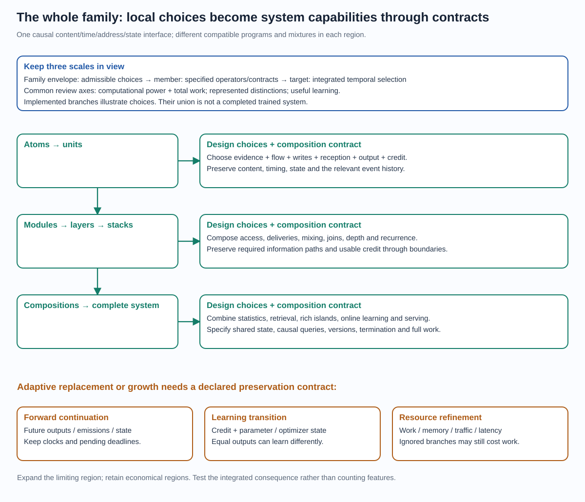

# How capabilities compose across the model family

[Overview](model_family_overview.md) · [Definition](model_family_design.md) ·
[Visual atlas](architecture_atlas.html) · [Evidence](architecture_evidence.md)

This is the composition guide for the whole family. A unit, layer or memory
branch is a choice inside a common causal event interface. Its useful properties
reach a complete model only when the interfaces preserve the needed information,
state, timing and credit. The rules below describe that transfer, including the
conditions for learned growth and replacement of a region.

## The envelope, a member and the integrated target

The **family envelope** specifies a shared interface and admissible ways of
forming temporal state programs. It includes rich operator libraries and lean
restrictions. A **member** fixes its actual operators, state, connections,
reception, schedule, queries and learner. The **integrated research target**
combines temporal computation, small learned messages, hard selective updates,
separate keys/values and useful unrealized-alternative credit. That target is
where we seek capacity beyond costly activity and a better quality/resource
frontier.

These distinctions avoid two errors. A winner-only member is not granted a
dense member's function class. Conversely, one restricted member's failure
does not exhaust the envelope's design options. Merely wrapping an existing
program as an event handler establishes no new expressivity, trainability or
efficiency result. A useful inclusion states the operators, causal state
transition and costs that actually reproduce it.

The family has common invariants: observed evidence has a causal boundary;
state has an owner and persistence rule; each emission/commit has a defined
event history; queries have a cutoff and completion rule; the learner declares
its credit and parameter versions; execution has a resource/termination
contract. Time-dependent computation and selective work are configurable
mechanisms within that contract. Disabling them can form an incumbent endpoint
or diagnostic without demonstrating the integrated target.

## A unit is a product of choices, not a fixed species

Each row can vary independently in the specification, although its consequences
must be checked jointly. Counts, neural vectors and learned fast parameters
can occupy different fields of the same unit; they need not be competing model
families.

| Local choice | Allowed examples | What must be specified |
| --- | --- | --- |
| Evidence | Signed modes, counts, protected facts, historical records, fast parameters | Precision, capacity, ownership, reset and overwrite |
| Temporal evolution | Identity, damping, rotation, gated flow, supported nonlinear map | Time units, dependence on the current input, stability and work |
| Injection / write | Additive statistic, gated proposal, selected replacement, protected append | Observed information and what persists after the event |
| Selection role | Observed address, stored key, content-conditioned score, race | Candidate discovery/support and timing distribution |
| Reception | First arrival, multiple deliveries, window, silence, exact aggregation | Membership, ties, stopping and pending state |
| Emission / query | Small residual message, timing-coded value, state readout, dense local block | Observable content, address, timing and accessible evidence |
| Learning | Exact statistic, factual derivative, local teacher, sampled return, replay | Which consequences are credited, horizon, estimator and producing versions |

For example, a count can supply a selection key while a vector supplies the
delivered value; a learned local program can turn elapsed time into a value
transformation; a silence receiver can control when several such values meet.
Their integration changes the computed function. Work on keys, values, writes
and learning remains separately accountable.

The flexibility is useful at the **whole-model** scale. A persistent selective
region can retain many facts while a richer local interaction combines the
few facts needed for a query. Temporal flow can transform those facts between
arrivals; a learned reception rule determines when complementary evidence
meets. Statistics can handle repeated local evidence while learned messages
carry abstractions across contexts. These are composable design options rather
than requirements for one uniform layer. The [evidence map](architecture_evidence.md)
records which combinations have completed support; broader mixed-world and
automatic-design integrations remain goals.

## Review what crosses each boundary

Computational power and required work, represented distinctions, and learning
conditions are three different entries in a capability description. Trainability
includes optimization and credit; statistical generalization additionally
depends on data, objective and inductive bias. More possible functions need not
mean fewer examples or easier fitting.

| Boundary | Computation / work that transfers | Representation that transfers | Learning that transfers |
| --- | --- | --- | --- |
| Atom → unit | Local operators plus their ordering; arithmetic is not enough to specify an event race | Content, clock, address and state coordinates actually retained | Continuous sensitivities within a history plus credit for changed histories |
| Unit → module | Discovery, proposals, reception and commits; add contention/communication | Evidence exposed to the module's accessible candidates and deliveries | Credit only for supported, observed or deliberately explored alternatives |
| Module → layer | Explicit joins, cross-channel maps and state-sharing rules | Relations possible through actual information paths | Coupled content/time derivatives and consequences of the join/route |
| Layer → stack | Serial execution, recurrence and activation/queue retention | Distinctions surviving every intermediate bottleneck | Chain conditioning, detach boundaries and future writer utility |
| Stack → composition | Read/write links between neural, statistical and historical regions | Complementary evidence available to a common query | Responsibilities for selection, writing, retrieval and fusion |
| Composition → system | Scheduling, caches, batching, optimizer and deployment overhead | State preserved across episodes, versions and external arrivals | Objective, scoring order, update ownership, consistency and total budget |

A module can hide its internal details behind a smaller interface if that
interface is sufficient for every allowed continuation. A payload of the right
shape is not sufficient merely because a downstream decoder accepts it.
Pending messages, deadlines, last-write times or eligibility may have to remain
part of the operational state even when they are invisible in the output.

## What the main composition operators guarantee

| Construction | Sufficient condition / useful consequence | Main failure or price |
| --- | --- | --- |
| Serial A→B | B receives the evidence, timing and ownership semantics its program requires; local credit chains through the actual interface | Erased distinctions cannot be restored by extra depth. Fixed-history derivatives omit changed membership/routes |
| Parallel A and B | Independent state can be composed by a product state; a declared fusion makes both branches available | Private facts remain private until fusion. Shared writes, random ordering and parameter updates may interfere |
| Recurrent / persistent | State and pending events carry across invocations under a bounded execution/reset policy | Retention is not accessibility or writer credit. Truncation can leave long-lived facts without useful learning |
| Neural + counts / retrieval | A causal update and explicit read/fusion path combine abstraction with direct evidence | Target leakage, stale keys, unreachable records and missing future write utility invalidate the intended benefit |
| Dense / synchronous island | Its operators, full participation, snapshot/barrier and aggregation are implemented | Exact local containment charges all required work; joining an island must respect the surrounding causal boundary |
| Optional / adaptive region | Compatible alternatives and an actual bypass preserve the parent; useful returns can train choices | A zero multiplier may still execute a costly branch. New clocks/joins may change the parent immediately |

For a realized execution, charge the work of invoked components plus adapters,
discovery, joins, queues and communication. Parallel branches generally **add
work**, while ideal independent latency follows a critical path rather than
that sum. Actual contention and hardware may lengthen it. Learning adds
alternative proposals, historical retention/replay, gradient accumulation and
optimizer work. Costs cannot be inferred from selected event count alone.
If regions reuse a cached or shared computation, charge that execution once
and include the storage, refresh and validity work; do not double-count it as
independent branch work or silently declare it free.

Representation is governed by the complete causal evidence at the boundary.
For example, histories 01 and 10 have the same count of ones but different
last symbols. A downstream “copy the last symbol” query cannot be answered from
that count alone. Keeping a timestamped record or a protected last-symbol
coordinate restores the distinction, with its own storage/access price.

Trainability needs its own argument. Two individually differentiable local
maps may compose into an ill-conditioned product. A hard route may make an
alternative unobserved. A detach can preserve all forward evidence while
removing credit to its producer. Conversely, a reliable counterfactual teacher
cannot teach a value that the forward graph can never deliver. Diagnose
information, execution support and credit separately, then test their coupling.

## Safe growth and morphing preserve future behavior

A region's operational state includes its private evidence, timing metadata,
pending messages/deadlines, and any state needed for the claimed learning loop.
For parent state S and expanded state E(S), a sufficient forward contract is:

    expand(advance_parent(S, event))
      = advance_child(expand(S), event)

with the same observable messages, query outputs and time semantics for every
admissible continuation. Here `advance` can include a finite internal event
trace; the child can use different hidden steps. Unused extra coordinates must
remain isolated until intentionally activated. A structural action that adds
new race rates, changes a join or discards a deadline fails this contract unless
its effects are explicitly compensated. The [formal conditions and witnesses](../experiments/theory/152_primitives_integration_and_capability_bounds.md#18-state-sufficiency-and-three-preservation-contracts)
make the scope precise.

Consider the popcorn example at query q=2: sum=2 and deadline=2.6 are pending.
Widening the state from m to (m,0), retaining that deadline and letting all parent
operations use the first coordinate preserves its subsequent emission. Clearing
the deadline can leave the current query's output unchanged while destroying
the message a later layer receives. A preservation test therefore resumes a
history and checks future state and emissions; it does not just compare one
current prediction.

There are **three separate preservation contracts**:

| Contract | What is preserved | What still needs a separate check |
| --- | --- | --- |
| Forward continuation | Queries and boundary emissions on allowed future histories | Derivatives, credit, optimizer and resource behavior |
| Learning transition | Credit, parameter/state/optimizer migration and the declared update trajectory | Runtime, memory, traffic and deployment behavior |
| Resource refinement | The same functional contract under a declared work/storage/latency budget | Quality learned from scratch, generalization and hardware energy |

An intentional change of function need not preserve the parent indefinitely.
The preservation contract specifies a safe starting point or replacement when
equivalence is claimed; learned deviations are then evaluated for their actual
quality and cost. Structural adaptation should keep useful freedom to change.

Forward equivalence does not imply the same learning. Reparameterizing
y=theta*x as y=phi²*x with phi=sqrt(theta), theta>0, preserves every forward
value. Equal-step SGD in theta and phi produces different functions after one
update. Optimizer migration/update rules must account for the coordinates.
Similarly, a zero residual can preserve the parent but be locally dormant:
y_parent+u*v*x with u=v=0 has no first-order gradient into either new scalar;
y_parent+w*x with w=0 has a live gradient when the loss cotangent and x are
nonzero. Parent preservation alone is not a trainability prescription.

## How to use this toolbox when a model falls short

Locate the earliest missing distinction, unsupported operation or broken credit
path. Choose one local change that repairs it: a retained coordinate, wider
message, additional candidate support, multi-message interaction, longer credit,
or a rich local operator. Specify the retained mechanisms and full incremental
inference/learning work. Establish the numerical/state/credit contracts before
an integrated comparison. Keep the successful parent and failed interventions
as evidence about those constructions.

Automatic design can eventually learn these choices. A structural policy needs
future task/resource utility and a state/version migration contract, not just a
local score for the current message. Forward behavior, useful learning and
economic benefit must then be evaluated together. This is a concrete path to
selective expansion across the family; a general learned structural optimizer
remains an open integration rather than a claimed completed result.
