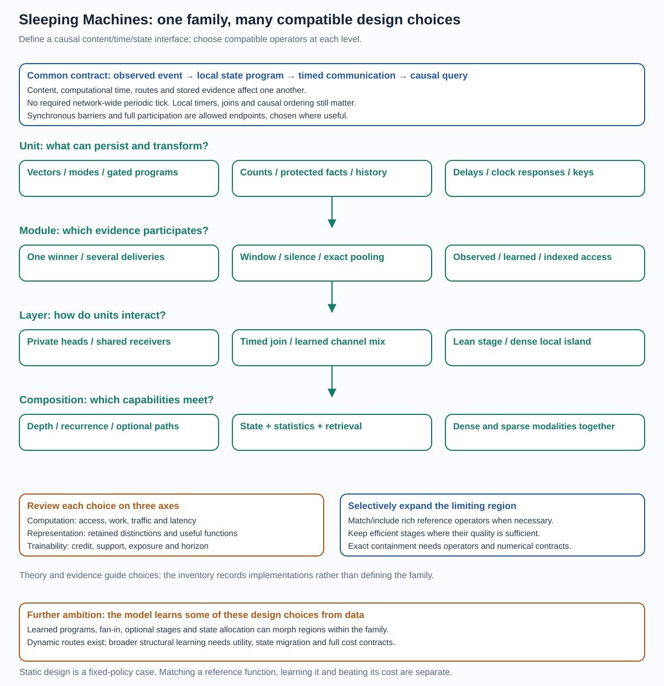
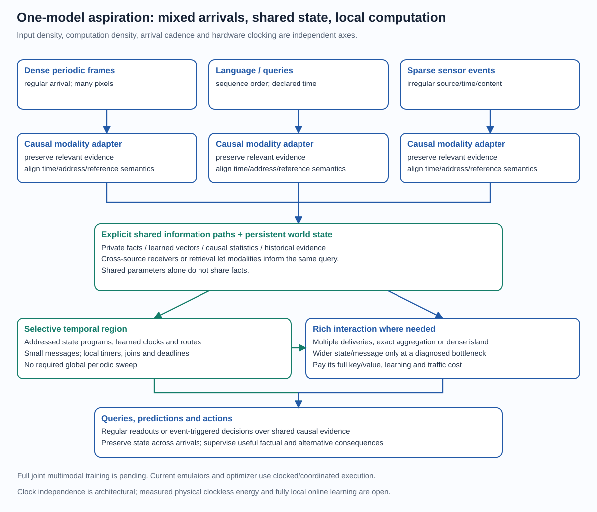
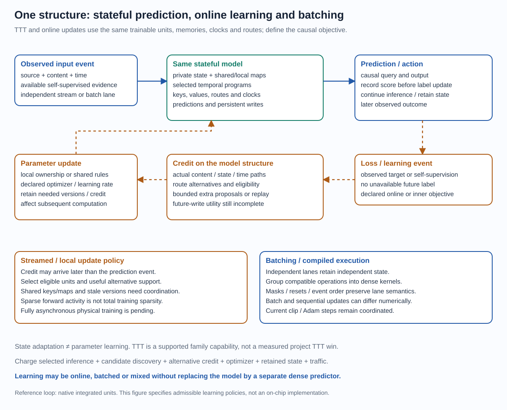

# Sleeping Machines as a model family

4 October 2026. A definition, design space and selection rationale.
[Short overview](model_family_overview.md) · [Visual atlas](architecture_atlas.html) ·
[Formal core](model_family_specification.md) · [Complete examples](model_family_members.md) ·
[Evidence map](architecture_evidence.md) · [Detailed review](architecture_review.md) ·
[Bounds](../experiments/theory/152_primitives_integration_and_capability_bounds.md)

## From the manifesto to a defined design space

The [original manifesto](../HISTORICAL_MOTIVATION_MANIFESTO.md) supplied the
motivation: computation through causal timing, local state and competing future
events, with learning informed by unrealized alternatives. Experiments then
tested particular primitives and realizations, separately and in combinations.
This document collects that practical and theoretical work into a coherent
model family, rather than declaring one benchmark configuration the final design.

The progression is **motivation → constructions and tests → family definition
and selection rationale → integrated validation and scaling**. Positive and
negative results constrain choices. Current proofs/measurements qualify earlier
intuitions; they do not erase the central temporal/selective ambition. The
current construction retains explicit keys/addresses as well as timing, so it
does not claim to have literally eliminated all memory indexing. Timing instead
adds operations, conditional access and interactions to the substrate.

The synthesis defines the toolbox, its composition and its position among
model families. It makes tested footholds and remaining integration gaps
visible. It is not evidence that all promising branches already coexist in
one scalable trained system.

## The family definition

Sleeping Machines is a family of **stateful event-processing networks in which
content, time, routing and persistent evidence jointly determine computation**.
An observation is an event with an observed source/address, arrival time and
content. Units retain local state. They transform incoming content and state,
determine candidate messages and computational times, and select or integrate
arrivals. Those events can change another unit's state, cause a later emission,
or answer a causal query. The same process composes through a graph or stack.

The research target is the subset that uses temporal computation, hard
selective communication/state updates, learned small representations, distinct
selection and value roles, and useful learning credit to unrealized alternatives.
Some family members disable mechanisms for a diagnostic or reproduce a known
primitive. Those limits establish relationships; they do not by themselves
demonstrate the complete target's advantage.

This is a generative description: choose the local state program, communication
and reception policy, then compose modules through their event interfaces.
The family is not defined by a 32-number payload, eight layers, two heads, one dataset,
one gradient approximation or one physical implementation. Nor is it merely
an unconstrained list of algorithms placed beside one another. The causal
content/time/state interface and its composed consequences supply coherence.

Keep three scales in view: the **family envelope** supplies the design choices;
a **member specification** fixes compatible operators and contracts; the
**integrated research target** combines the distinctive temporal/selective
mechanisms and tests their quality/resource benefit. Inclusion in the envelope
does not give a restricted member every other member's capability. The
[composition guide](model_family_composition.md) explains how unit choices
transfer through layers, stacks and systems, and what adaptive replacement
must preserve. Implemented branches are examples of this generative definition.

## The common computation contract

The [formal core](model_family_specification.md) is the canonical membership
and compatibility specification: twelve fields define evidence, operators,
composition, state, interfaces, participation, schedule, queries, objectives,
learner, bounds and execution/evidence. It includes a conditional construction
grammar. The [complete examples](model_family_members.md) instantiate every
field for contrasting members. This guide explains the design choices and
their rationale rather than introducing another competing specification.

At an addressed unit, local state has a represented value m and timing metadata.
For an incoming event e=(a,t,x), the unit can perform:

    read/evolve:        m_read = F(m, elapsed_time, incoming_controls)
    form candidates:   (m_proposed, value, timing_parameters) = U(m_read, x)
    decide/recruit:    identity, arrival, reception = P(keys, content, state, clocks)
    commit/communicate: apply selected writes; deliver selected or integrated events
    query:             prediction = R(accessible evidence at the declared cutoff)

These are semantic stages, not a mandatory evaluation order or software API.
For example, the native unit reads its stored key before its proposal flow;
some units accumulate all arrivals before deciding; counts increment only
after the relevant outcome is observed. State changes can affect subsequent
keys, content, clocks and decisions. A model's precise causal order is part
of its definition, especially for ties, deadlines, cancellations and resets.

Time is not just an extra input feature. A delay can change which messages
meet; elapsed time transforms a represented vector; a race changes the selected
program; a timeout turns absence into an event. This supplies conditional
temporal programs. A software emulator can implement that semantics while
remaining clocked and serial; physical asynchrony is a separate implementation.

Three meanings of time should not be conflated:

| Coordinate | Meaning | Contract |
| --- | --- | --- |
| Observation time / order | When externally observed evidence is available | Defines admissible information; token position and sensor seconds need an adapter |
| Modeled event/computation time | The coordinate used for local flow, learned delays, races, joins and deadlines | Can be related to observation time; units, precision and causal update rules must agree |
| Measured execution time | CPU/GPU/chip time needed to execute the predictor and learner | A serving/resource measurement; software speed is not automatically the modeled delay |

These need not be three separate tensors in every implementation. They are
three semantic roles. A delayed model computation may finish after its declared
observation cutoff without being allowed to consume later evidence silently.
The [worked reception example](model_family_example.md) demonstrates local
deadline and query distinctions without running a learned model.

## Composition contracts: what must survive the interfaces?

| Contract | Required specification | Failure it prevents |
| --- | --- | --- |
| Information and type | Payload/state schema, source/address meaning, projection and precision | A later module receives an erased or incompatible distinction |
| State and ownership | What persists, who reads/writes it, reset and overwrite rules | Shared weights mistaken for shared facts; accidental resets or conflicting writes |
| Time and schedule | Causal dependencies, equal-time priority, transport, local deadlines and joins | Equal timestamps mistaken for synchronous snapshots; silence flushed prematurely |
| Query and supervision | Observation cutoff, accessible state, completion rule and labels | Future evidence leaking into prediction or targets changing the input adapter |
| Credit and versions | What factual/alternative consequences are taught, horizon, caches and producing weights | Retained facts mistaken for writer credit; old cotangents or cached keys presented as current |
| Resources and termination | Candidate support, active work, queues, precision and finite execution limits | Dormant capacity mistaken for free learning; an event loop exceeding its budget |

Independent local updates can execute in either order when their read/write
sets and emitted-event dependencies do not interfere, parameters are fixed and
random draws have an order-independent assignment. Shared writes, global
updates, reductions, joins or retiming require a declared order/aggregation
contract. Asynchrony permits partial ordering; it does not make every reordering
equivalent.

Finite input alone does not guarantee a finite event execution: a recurrent
graph can generate infinitely many events, even within bounded modeled time
if positive delays shrink fast enough. A member needs a finite work/depth cap,
a terminating schedule or an appropriate no-accumulation condition. Dense
synchronous and sparse asynchronous regions both fit these contracts. They
are not reasons to abandon temporal computation; they make its implementation
and claimed containment precise.

## Design choices at every level

| Level | Options within the family | Consequence / interaction | What should guide the choice? |
| --- | --- | --- | --- |
| Observation / event | Raw marks; causal packets; explicit source IDs; learned shared content codes | Defines which identity, order, intervals and information can reach any later unit | Preserve task-relevant information first; coalesce only when sufficiency/closure or a measured quality trade-off supports it |
| State representation | Signed vectors; protected coordinates; counts/occupancy; historical key/value records; hybrids | Chooses what is stored directly and what must be compressed or inferred | Use statistics for well-supported repeated evidence, vectors for abstraction, protected/historical state for facts that must survive |
| Local temporal program | Damped modes; rotations; gated retention/injection; delays; finite taps; supported affine or nonlinear maps | Determines retention, interval sensitivity and the cost of evolving state | Begin with stable, identifiable modes and a useful information path; enrich dynamics only when simpler states fail on the required distinction |
| Unit output | Scalar event; small vector; residual continuation; state-dependent value; learned key/value separation | Sets communication bandwidth and what survives a stage | Keep a live informative continuation; widen messages when information/feature evidence warrants the added quadratic map cost |
| Routing / module | Observed addressing; fixed/context index; learned keys; categorical or deterministic race; selected multi-delivery | Determines which program/evidence is accessible and recruited | Preserve useful candidate support; distinguish discovery, choice and common clock; charge all candidates and admit deterministic choices on their own credit scope |
| Reception / emission | First arrival; several winners; compact window; threshold/hold; silence timeout; bounded deadline | Controls interaction, precision, activity and latency | Winner-only when evidence is concentrated; several messages for complementary evidence; smooth windows or exact option credit when boundaries matter; cap starvation explicitly |
| Layer interaction | Independent heads; learned cross-channel mix; timed join; sparse graph; shared or isolated sources | Determines which local computations can inform each other | Introduce an explicit path for every required joint relation; multiple heads should earn their work through complementary evidence, not head count alone |
| Stack / recurrence | Serial depth; recurrent state; identity growth; optional branches; affine scans where closure holds | Builds hierarchical temporal functions and persistent computations | Preserve information and usable credit at each added stage; demonstrate useful depth against matched shallow/width controls |
| Memory composition | Native state only; count cascade; learned statistic pool; outcome bank; historical retrieval; combined state/lookup | Trades compression against direct evidence, long access and learning cost | Add memory when a controlled task requires evidence missing from the current state; do not assume a larger inaccessible bank improves capability |
| Query / readout | Affine; bilinear/polynomial; categorical; regression; hazard; proper prefix/stopping objective | Determines which retained distinctions are observable and which timings matter | Choose the simplest adequate interaction/readout; distinguish retained information, decoder expressivity and encoder learning |
| Learning mechanism | Factual derivatives; local value teacher; paired actual returns; sampled alternatives; historical eligibility; horizon and phase/score calibration | Teaches both representations and the conditional program that produces them | Use exact cheap utility where available; spend replay on future consequences that a local teacher misses; audit actual parameter updates and horizon |
| Endogenous design control | Learned operator/support choices; variable reception; optional stages; state allocation; controlled growth/pruning | Lets data determine some family choices during training, rather than fixing all of them beforehand | Begin with contract-preserving nested changes; give structural actions future task/resource utility and track state/version migration |
| Execution / deployment | Sequential reference; episode batching; compiled maps; cached selected proposals; packed workers; event hardware | Implements the same or explicitly changed semantics at different costs | Preserve numerical/state/gradient contracts as appropriate; measure the workload that matters rather than treating event count as energy |

These choices interact. A wide state cannot help if candidates never expose it.
A sparse route cannot be learned cheaply merely because inference is sparse.
A useful clock coordinate can become uncontrollable if content/key sensitivities
are clipped. A short credit horizon can leave a retained fact's original writer
untrained. The best design is a compatible combination rather than independent
maximization of every row.

## Terminology used throughout the documentation

| Term | Meaning here |
| --- | --- |
| Program / unit | A local transformation with declared evidence state, time behavior, reception and emission rules |
| Module / layer | A composition of programs exposing a content/time/state interface; a layer is a declared stage, not necessarily one global synchronous sweep |
| Stack / system | Serial composition; or the complete model with adapters, memory, schedule, objective, learner and runtime |
| Key / value | Features used to recruit a program/evidence item; and the content delivered after that choice. A selected write may retain different state from the delivered value |
| Available / discovered / selected | Programs or facts that exist; candidates actually inspected; and those recruited for computation, delivery or commit |
| Counterfactual credit | Teaching an unrealized choice from a specified alternative utility. A local message teacher, complete future return and structural-action return have different scope |
| Persistent state / learned parameters | Facts and context updated by events; reusable rules changed by a learning policy. Some inner learners deliberately store fast parameters in state |
| Sparse | Specify the object: connections, candidate support, active programs, deliveries, writes, gradients or optimizer work. Sparsity of one does not imply sparsity of all |
| Asynchronous | A causal partially ordered update schedule without mandatory global periodic barriers; equal-time priority and shared-state consistency still belong to the member |
| Adaptive graph | Event-dependent active paths within a containing graph, or broader learned structural changes; distinguish those two meanings |
| Native | The project's integrated temporal receiver construction, or adaptation within its own trainable structure; not a statement about custom physical hardware |
| Capacity / retention / access / credit horizon | What could be stored; how long evidence survives; what a query can retrieve; and how far learning reaches to its original producer |
| Subsumption / matching / advantage | A stated function/state or execution/learning containment; measured performance parity; or a better declared quality/resource trade-off |

These definitions keep the family-level freedoms separate from any single
experimental member. The [evidence map](architecture_evidence.md) gives each
principal claim's actual support and boundary.

## Inclusion: synchronous and dense constructions are allowed endpoints

At the **model semantics** level, a general asynchronous event graph can
include a synchronous network. Restrict computation to prescribed shared
times, read the preceding state snapshot, evaluate the required units and
commit together before the next step. The shared times/barriers are a chosen
schedule, rather than a mandatory clock in the broader family. Equal
timestamps alone are insufficient: immediate sequential commits could expose
a neighbour's newly written state and change the predictor. Simultaneous
inputs, ties, transport and update order need an explicit contract.

Similarly, **configurable support includes full support**: if a communication
or execution mask M can choose any supported subset, the all-ones mask is its
dense endpoint. A k-delivery policy with k allowed up to U can deliver the
entire candidate set. To reproduce a dense reference, it must also apply the
reference aggregation, gates and local operations, not merely deliver more
messages. A fixed k=1 subfamily does not contain arbitrary dense pooling;
strictly sub-full-support budgets do not include dense execution at that budget.

This is the useful sense of synchronous being a special case of asynchronous,
and dense being a special case of configurable sparsity. It is about the
allowed family, not an assertion that every member is strictly sparse or
asynchronous. The family permits both endpoints **inside the same composition**
and lets individual layers lie between them. There can be asynchronous state
maintenance, a synchronous dense reasoning island, then selective event-driven
actions. Its interface must preserve causal observation cutoffs and the
information needed by each region.

Three further inclusions are separate:

- A **function inclusion** reproduces predictions and state transitions.
- An **execution inclusion** reproduces a schedule and numerical semantics.
- A **learning inclusion** reproduces the objective and required derivatives
  or estimator, updates and credit horizon.

One does not establish the others. An event emulator may reproduce dense
predictions while adding overhead. A hard-choice surrogate need not reproduce
the dense reference's gradients. Fully asynchronous physical hardware is not
required to test event semantics, and clocked hardware can be efficient for a
dense region. The research target still emphasizes temporal computation,
selective useful work and counterfactual learning; dense/synchronous endpoints
are comparisons, local capability restores or legitimate hybrids, whose
separate results do not establish advantage for the selective target.

## Computational, representational and trainability axes

At every level ask the same three questions:

1. **Computational capacity:** what transformations, decisions and access can
   execute, with what work, latency, storage, traffic and precision?
2. **Representational capacity:** which histories/relations does the state
   preserve, and can the query actually access and distinguish them?
3. **Trainability:** do useful alternatives have support, correct or adequately
   faithful credit, enough exposure and horizon, and a stable useful update?

Parameter capacity, evidence-state capacity, candidate discovery, selected
activity and counterfactual learning capacity are independent resource budgets.
Their separation is the opportunity, and their effective coordination is the
challenge. The [bounds note](../experiments/theory/152_primitives_integration_and_capability_bounds.md)
states information loss, finite-state storage, candidate omission, sampling,
exposure, horizon and conditional-depth limits; it does not collapse these
questions into a single parameter count or universality assertion.

## Where this sits among model families

The closest high-level category is a **hybrid dynamical event-processing network
with configurable stateful conditional computation**. Its shared interface is
content/time/address plus persistent state and declared causal reception/query
rules. Its local operator library, support/schedule constraints and learning
mechanism define a particular subfamily. Fixed clocks, full participation or
disabled memory are allowable limits; they are not required defaults. It
intersects several established families:

| Existing category | Shared capability | Distinctive design direction here | Inclusion boundary |
| --- | --- | --- | --- |
| Recurrent neural / continuous-time models | Persistent state and input-dependent updates | Private addressed state, computational emissions and temporal routing | Exact standard-cell containment needs its actual maps/gates, not just recurrence |
| State-space / temporal filter models | Analytic event flow and multi-timescale modes | A selected state program can change timing, communication and future evidence | Supported exponential modes are exact; arbitrary full reference stacks require more operators |
| Attention / associative memory | Query/key compatibility and value delivery | Timing can sample, aggregate or transform retrieved evidence; state also selects when written | Exact delay-coded attention and stochastic winner means have different costs and gradients |
| Sparse conditional / MoE models | Many available programs, few selected executions | Experts can retain private state and emit timed messages; credit includes future memory utility | MoE already establishes sparse capacity; a selected mixture requires its aggregation |
| Statistical estimators / compression | Direct empirical evidence and sufficient statistics | Learned temporal representations can choose or complement statistical memory | Counts/backoff can be reproduced exactly with required statistics; neural vectors do not automatically learn them |
| Hybrid/event/spiking computation | Event ordering, temporal predicates and learned delays | Small vector content, timed state programs and counterfactual alternatives in a common construction | Prior art exists; finite precision and full scheduler/learning work remain explicit |

The model family is not a blanket claim of a strictly larger efficiently
learnable class than every existing family. Many are already computationally
universal under ideal assumptions and can implement similar finite functions.
The relevant claim is a potentially better **organization of computation,
evidence and learning** for useful workloads. Exact emulation can establish
expressivity but consume the same or greater resources than the original.

**Broad representational reach is a defensible ambition.** Any finite executed
reference predictor can be mapped into an event graph if the chosen local
operator library supplies its primitives, the event/state interfaces preserve
its information, and storage, precision and schedule reproduce its numerical
semantics. Deliver dependencies to each operator, retain recurrent state and
impose reference barriers where needed. Induction over that execution reproduces
the predictor, including its state transitions. With compatible update
operators the same construction can reproduce a specified learning algorithm.
This is a conditional constructive containment argument, not a benchmark result
or a claim every present native subfamily implements all those primitives.

Thus **asynchrony and configurable sparsity need not cap us below existing
models**: their synchronous/dense endpoints permit matching existing
computation, while additional state/time/reception choices can offer better
constructions. No reviewed representational obstruction prevents this broad
direction. At a fixed small memory, message, discovery, learning or compute
budget, particular members do have limitations. Universality does not create
a strictly larger class than all finite computable predictors, nor guarantee
equal training, equal cost or superiority. The substantive goal is to match
strong predictors with a better useful quality/learning/resource frontier.

## How the choices produce advantage together

The most coherent thesis has four coupled parts:

- **Store facts separately from reusable rules.** Private state/counts/history
  can grow while processing maps share training exposure. Useful capacity need
  not require running all maps or relearning all rules for every stored fact.
- **Use time as an operation.** Transport, matching, grouping and emission
  happen according to learned times rather than requiring an idle periodic
  sweep. Precision and deadlines still cost resources.
- **Recruit conditional programs.** A key match chooses a stateful transformation
  and its temporal behavior, not only a static value. Several cheap temporal
  responses may reuse an expensive match where that is useful.
- **Teach unrealized consequences.** Hard inference can remain selective while
  learning examines missing alternatives, including writes and later utility.
  Savings require useful credit at an economical complete learning budget.

Each part has precedents and some scoped project evidence. Their combination
is the candidate contribution. There is no theorem that this automatically
dominates dense attention, recurrent models, event SSMs or counts. There is
also no reviewed obstruction to a well-chosen member achieving useful advantage.

## A continuum of capability and cost, chosen per module or layer

The ambition is **lean where selectivity is sufficient, richer where the task
requires it**. A layer may receive one message, another may pool several, and
a third may aggregate every relevant value. Units can differ in state width,
timescale, historical access and local program. A count memory, neural temporal
stack and dense attention island can coexist within one causal model. Uniform
width, fan-in, reception rule, depth and learning budget are implementation
choices, not family requirements.

This gives more explicit timing, state-ownership and reception choices than a
fixed standard Transformer, SSM or feed-forward MoE template. It is not a claim
that other researchers cannot extend those families: they can also build
hybrids. Our proposed advantage is a common design/learning interface for
these choices and an economical useful construction, rather than exclusive
ownership of architectural flexibility.

This is an envelope of possible constructions, not a promise that one sparse
native unit already contains every incumbent operator. For each proposed
containment, specify the maps, stored information, aggregation, precision,
normalization and causal schedule needed to reproduce the reference. A dense
submodule connected through the event interface is a legitimate family
composition; an exact native temporal realization is a stronger, separate
claim. Either can restore a needed function, but its full work must be paid.

| Capability to match / include | Sufficient construction or boundary | Extra design freedom and price |
| --- | --- | --- |
| Counting / backoff | Explicit causal counters, address lookup and the reference smoothing/update law reproduce that estimator | Add learned pooled evidence and temporal/nonlocal context; all state, lookup, adaptation and mixture work remain |
| Supported SSM filters | Required exponential/rotation modes with affine event injection reproduce the supported filter | Select state programs, retain different private timescales, add nonlinear writes or routes; arbitrary reference matrices need an appropriate local operator |
| Recurrent gated cells | Provide the reference cell's actual state, gates, arithmetic and readout, or integrate that cell | Vary when/where cells run and what they communicate; the present native additive-write cell is not an exact LSTM proof |
| Softmax attention | Aggregate all relevant key/value pairs with normalization, or use the exact delay-coded identity under its support/clock/precision assumptions | Choose winner, multiple deliveries, shortlist or exact pooling per layer; winner sampling only matches the mean, and exact pooling pays value delivery and normalization |
| Complete Transformer block/stack | In addition to attention, supply the reference FFN, residual, normalization, positional and causal operators with compatible numerical semantics | Embed dense islands inside timed/stateful graphs, vary activity elsewhere; an attention identity alone does not reproduce a complete trained Transformer |
| Sparse expert routing | Include the reference scoring, selected expert functions and weighted combination | Experts may hold facts, use temporal state and emit learned times; persistent-write utility and communication add learning/cost requirements |

If a configured construction exactly reproduces a reference predictor, copying
its operators/weights where supported gives the same predictions under the
declared numerical contract. This establishes an available performance point,
not successful discovery of that point by a different training algorithm.
At fixed resources a sparse restriction may not contain the reference at all.
Expanding the envelope can restore representational access while still requiring
a faithful estimator, adequate exposure/horizon and effective optimization.

Use diagnosis to select the expansion:

| Observed failure | First local knob to examine | What it cannot repair alone |
| --- | --- | --- |
| Required facts never enter the candidate set | Broader discovery, accessible history or an explicit cross-source path | Credit cannot recover omitted information |
| Several complementary facts are needed together | Multi-delivery/window or exact aggregation at that receiver | A sampled winner expectation is insufficient through arbitrary nonlinear composition |
| Necessary distinctions are compressed away | Wider/protected state, message bandwidth or historical evidence before the loss occurs | Adding width later cannot invert an earlier lossy bottleneck |
| Function is accessible but alternatives are not learned | Better utility credit, support/exploration, horizon, calibration or exposure | A larger message alone does not teach an uncredited future write |
| Dense computation is required only in one region | A rich local program or dense island at that region; selective stages elsewhere | Savings are a whole-model accounting question, not the fraction of sparse layers |
| Precise continuous prediction is noisy | Controlled clocks or multiple samples/aggregation with matched compute | Less randomness is not automatically correct categorical or long-horizon learning |

There is useful formal support for **nested** expansions: adding parameters
with a zero-initialized residual path can preserve the parent function and add
columns to its local prediction Jacobian, so its infinitesimal reachable output
directions cannot shrink at that point. This does not imply useful target
alignment, finite-step conditioning or generalization. Adding a branch to a
normalized race generally changes the parent probabilities and clock unless
its introduction has an explicit gating/normalization contract. Likewise,
more heads need a parent-preserving join if exact nesting is claimed.

Per-layer tuning should therefore compare a parent-preserving richer member
against the lean parent, then remove unnecessary work under a quality constraint.
Spend dense work at a demonstrated information or credit bottleneck. Prefer
the integrated temporal/selective substrate elsewhere when it earns its place.
The vision is a better attainable quality/resource frontier, rather than a
requirement that every layer defeat every dense operator in isolation.

## A further ambition: automatic model design inside the family

The family should support **endogenous computational-graph adaptation**: data
can teach a model to move between admissible family choices, rather than only
teaching weights inside a hand-chosen fixed construction. Static architecture
selection is the fixed-policy special case. There are three distinct forms:

| Adaptivity | What changes? | Status / requirement |
| --- | --- | --- |
| Parameter adaptation | Local maps, keys, clock controls, gates and readouts | Implemented gradient learning; actual useful update and scope remain measurable |
| Event-level execution adaptation | Winners, addressed writes, message order and active routes depend on input/state | Core implemented native behavior; the containing pool/stack is usually fixed |
| Structural adaptation | Operator type, reception fan-in, optional depth, width/state budget, connections or module allocation | Broader ambition; some optional/nested constructions exist, but no completed general learned-morphing system |

One construction is a library of admissible local programs with a learned
policy choosing a program, support/fan-in and optional continuations. It can
move a region from winner-only toward pooled/exact interaction when joint
evidence warrants the cost, or recruit longer-lived memory when needed.
Another changes allocated structure through parent-preserving expansion and
controlled pruning. These approaches can mix and can learn at different
timescales: an event chooses work, while slower training reallocates capacity.

The policy should receive **task utility plus an explicit resource constraint
or price**. An illustrative objective is expected causal loss plus beta times
the declared work/latency/memory costs; a constrained quality/resource frontier
is another choice. The accounting must include exploration, scoring unchosen
programs, counterfactuals, state migration and optimizer work. A zeroed gate is
not a runtime saving if its program still executes.

Structural learning has the same central credit problem at a larger scope.
An alternative operator/write may help only after future events; a local
emitted-value cotangent cannot certify that utility. Relaxed mixtures,
sampled structural actions and replay have different bias/work/variance.
The necessary support, horizon and exposure depend on the action's consequence,
not just on how many operators the library contains.

Morphing must also preserve a meaningful state interface. Widening may embed
old coordinates and initialize a new residual path to zero. Changing temporal
modes or an aggregation policy needs a declared state/time contract. Replacing
an exact count bank with a compressed vector can lose facts; reversing that
change cannot reconstruct erased history without retained evidence/replay.
Pruned state may be archived, migrated or intentionally reset; optimizer and
cached-key versions must follow the change. Simultaneous/dense endpoints remain
available only when the required maps and scheduling/aggregation contracts exist.

For a frozen supergraph with compatible state interfaces, architecture policy
can be added to the model state; a constant policy recovers an included static
construction. This provides a clean starting definition. Growth beyond a
fixed supergraph requires an allocation/state-migration contract, not only a
gradient on a gate. Holding a parent function initially unchanged aids a fair
comparison, but it neither guarantees useful structural credit nor search
convergence.

This is related to **neural architecture search (NAS), network morphism and
elastic/supernetwork training**, which already provide important precursors:

| Precursor | Established idea | Lesson for this family |
| --- | --- | --- |
| [DARTS](https://arxiv.org/abs/1806.09055) | Continuous relaxation enables gradient-based architecture search | Architecture and operator weights can learn together; a relaxed mixture and its eventual hard graph need separate contracts |
| [Net2Net](https://arxiv.org/abs/1511.05641) | Function-preserving transformations transfer a network into wider/deeper versions | Prefer controlled parent-preserving growth; persistent temporal state/clock semantics add migration requirements |
| [Once-for-All](https://arxiv.org/abs/1908.09791) | An elastic trained network supplies subnetworks across width, depth and other dimensions | Avoid retraining every configuration independently; deployment specialization is distinct from event-by-event structural choice |
| [ProxylessNAS](https://arxiv.org/abs/1812.00332) | Search targets the actual task/hardware while reducing architecture-search memory demand | Use actual target costs, candidate-work accounting and an affordable alternative policy |

The proposed extension is to search/adapt **stateful temporal programs**:
clock laws, reception windows, delayed writes, alternative memory policies,
asynchronous/dense islands and useful future consequences. Adaptation may select
a final static design, retain a conditional policy, or change allocation on a
slower learning timescale. Those are distinct objectives. Automatic design is
not invented here; integrating it with temporal evidence and economical
future-route credit is the specific open direction.

The practical order is: retain the successful integrated baseline; locate an
information/credit/work bottleneck; introduce one nested adjustable choice;
verify state/forward/learning contracts; test whether training learns its useful
resource trade-off; expand only on completed evidence. This adds a direction
to the family without changing any current frozen owner queue or kernel.

## One model across dense, sparse, synchronous and asynchronous worlds

These are four independent axes: **input density**, **computational activity**,
**arrival cadence**, and **physical clocking**. Dense camera frames can arrive
periodically yet update only selected internal state. Sparse events can arrive
irregularly yet trigger an expensive dense local computation. A synchronous
readout can query state maintained by asynchronous updates. A clocked GPU can
simulate event semantics; its hardware clocks do not define the model's causal
update schedule.

The intended single-model composition maps frames, tokens, sensor events and
queries into compatible content/time/address interfaces. Explicit shared
receivers, cross-attention or event paths let those observations update a
common persistent world state. Queries/actions can be regular or event-driven.
Local dense islands supply interactions that need many simultaneous values;
selective temporal modules maintain and transform evidence between them.
Source-specific state and privacy/isolation may still be useful, but shared
weights alone do not ground two sources in shared facts.

Modality adapters must preserve relevant information and establish compatible
time units, order and reference frames. A token position is not automatically
a physical sensor timestamp. Paired evidence, causal objectives and credit
through the actual shared path are needed for learned grounding. Existing
separate language, forecasting and neural-decoding experiments establish
capabilities of members, not a completed jointly trained multimodal model.

## No required global periodic update clock

The architectural semantics do **not require a global synchronous tick** that
updates every unit or forces every layer to advance together. An arrival,
local race completion, threshold or deadline can cause work; idle units need
not be periodically swept. Local temporal flow can be evaluated when state
is read, when the declared dynamics admit that lazy evaluation. A local timed
join synchronizes its required inputs, without imposing a network-wide barrier.

This does require causal order and usable time: timers, reference events,
timestamp precision, deadline handling and sometimes clock calibration or
watermarks. Absence becomes evidence only after an observable timeout. Races
must distinguish modeled computational delays from transport contention or
physical device delay. The current CPU/GPU programs, episode batches and Adam
steps use conventional clocked/coordinated execution. Fully asynchronous
hardware and fully local online learning are implementation targets, not
measured properties of those runs.

Potential benefits include avoiding idle updates and global update barriers,
reacting promptly to irregular signals, matching computation to local demand,
keeping state near its owner and reducing global clock-distribution activity
on a suitable physical substrate. Those can improve utilization, latency or
traffic without changing the mathematical predictor. They need workload and
hardware measurements: event queues, key discovery, timers, handshakes,
communication and contention also cost work and energy. Dense continuous
workloads can favor mature synchronous batching instead.

## Native online learning, test-time training and batching

**Learning belongs to the same stateful model structure.** A deployed unit
retains its state, trainable maps, timing/routing parameters and declared update
rule. Causal outcomes or self-supervised observations can supply loss/credit
to those same operators; a separate dense predictor is not an architectural
requirement. This permits native online parameter learning and **test-time
training (TTT)**, as well as ordinary fixed-weight stateful inference.
Alternative-route learning may recruit additional candidates or replay; its
work is additional to the selected factual computation.

| Adaptation level | What changes during deployment? | Family capability / current boundary |
| --- | --- | --- |
| Persistent inference state | Private vectors, timestamps, source context and stored evidence | Native state updates already exist; this alone is not gradient-based TTT |
| Statistical adaptation | Causal counts, occupancy, escape/recency evidence | Explicit estimator branches update online; these updates need no parameter gradient |
| Local learned memory / fast parameters | Selected unit maps, learned memory parameters or an explicit inner learner | Admissible local update program in the family; exact TTT-layer containment needs its inner objective/map/update, and outer derivatives if claimed |
| Routing and message parameter adaptation | Content maps, keys, clock controls and their coupled dependencies | Same trainable structure can continue learning with causal objectives; affordable complete future-write credit and asynchronous update contracts remain open |
| Shared/global parameter adaptation | Tied rules, readouts or broader subnetworks | Can aggregate streamed or batched credit; shared ownership/versioning and optimizer cost are explicit |

For next-event prediction the causal order is **predict, observe the outcome,
learn, then predict later events**. Self-supervised adaptation before a query
may use already observed content, but never an unavailable future label. The
evaluation protocol must declare which state/weights persist, resets, adaptation
data, learning budget and what score is recorded before or after each update.
An offline test score cannot be reused as evidence for an untested TTT protocol.

Asynchronous and sparse learning are permissible choices: losses/credit can
arrive at different times, update eligible local programs, and sample a bounded
alternative set instead of evaluating every proposal. But complete sparsity
does not follow from a sparse forward route. Exact normalized routing can
touch every scored key; shared maps, optimizer moments, decay and delayed
credit may require additional work or coordination. Local parameter ownership,
credit/eligibility retention, stale versions and event/update ordering need an
explicit contract. Fully asynchronous updates need not equal synchronous
full-sequence backpropagation; any claimed equality requires proof.

Batching is compatible with the same construction. Independent event streams
can carry independent state in batched lanes, and compatible local operations
can be grouped into kernels. Declared masking/reset/order rules preserve each
lane's causal prediction semantics. A batch-reduced parameter update and
sequential online updates generally produce different parameter trajectories;
that is a learning-policy choice, not different model expressivity. Current
batched/compiled programs establish practical batching, while their global
clipping and Adam steps remain coordinated.

The opportunities are continual personalization, changing-environment
adaptation and learning near the state owner without retraining the whole
substrate. They require suitable causal objectives, stable useful updates and
measured end-to-end quality/cost. The current review establishes structural
support and existing state/statistical/batched mechanisms. An earlier neural
family branch also has a [completed causal online pilot](../experiments/results/online_language/local_integrated_online_backbone_D8192_20260930T200000Z.json):
3.190859→3.095738 BPC on8,191 development targets, for10.736× total processing
work. It uses one checkpoint/window/rate, paired block noise, persistent state
in both arms and block-delayed predict-before-update feedback. Preserve that
positive scoped evidence; **integrated native TTT, drift retention, an economic
adaptation advantage and fully asynchronous on-chip training remain open**.

TTT itself has precedents: [test-time self-supervised adaptation](https://arxiv.org/abs/1909.13231)
updates a deployed predictor; [TTT layers](https://arxiv.org/abs/2407.04620)
use a learned model as recurrent hidden state;
[Titans](https://arxiv.org/abs/2501.00663) combines learned long-term neural
memory with attention. The additional design direction here is selected
stateful temporal programs with joint content/clock/route credit and optional
statistical/historical evidence. Those papers' measured gains do not transfer
automatically to our construction.

## Comparisons that guide design rather than assume victory

| Closest alternative | Strength we must match or use | Why add the family freedoms? | Condition for an actual advantage |
| --- | --- | --- | --- |
| Transformer / efficient attention | Learned content-addressed aggregation, global interactions and mature dense kernels; FlashAttention reduces IO for exact attention | Persistent private state, learned temporal programs and adjustable delivery fan-in, with exact/dense aggregation where required | Comparable quality after paying candidate search, value access, training, state traffic and workload-specific serving cost |
| Mamba / event SSM | Compact recurrence, selective dynamics and efficient scans; event SSMs already process irregular times | Stateful program selection, explicit facts/history and nonlinear timed interactions beyond a configured filter | Those extra distinctions improve the task enough to pay their routing and learning cost |
| MoE / structured memory | Existing capacity beyond selected expert work; structured indexing can avoid scanning every key | Private stateful experts, computational clocks and a choice of evidence types | Useful specialization and economical discovery/write credit, not merely more dormant parameters |
| TTT layers / neural adaptive memory | Native learned-state updates and deployment-time adaptation already have precedents | Vary which private temporal program learns, the incoming credit schedule, alternative routes and evidence types | A causal, stable adaptation gain after charging credit, optimizer, retained graph/state and extra queries |
| Counts / causal lookup | Direct, cheap statistical evidence; exceptionally strong in its well-supported regime | Reuse statistics while learning pooled, temporal, compositional or nonlocal relations | A controlled residual gain outside the competent estimator's regime, with full mixture/update work |
| Temporal graph / neuromorphic systems | Event-triggered state and asynchronous communication already have precedents | Unified small vector messages, temporal programs, statistical memory and counterfactual choice/write learning | The complete construction has a reproducible quality/resource benefit over a relevant event-based control |

References: [Transformer](https://arxiv.org/abs/1706.03762),
[FlashAttention](https://arxiv.org/abs/2205.14135),
[Mamba](https://arxiv.org/abs/2312.00752),
[EventSSM](https://arxiv.org/abs/2404.18508),
[sparse MoE](https://arxiv.org/abs/1701.06538),
[product-key memory](https://arxiv.org/abs/1907.05242), and
[Temporal Graph Networks](https://arxiv.org/abs/2006.10637).
These are operator/family comparisons, not a current public leaderboard ranking.

## Current selection principles, with their strength of support

| Decision | Working choice / intuition | Basis and limit |
| --- | --- | --- |
| Rule/evidence organization | Prefer shared processing maps with genuinely private state when new state should store additional evidence | Capacity/exposure reasoning and scoped tied-state results; private keys still need training/discovery |
| Temporal backbone | Retain learned physical-time/content coupling and small residual message paths | Core thesis, analytic contracts and positive temporal/native fits; no reason to replace it with a carrier-only diagnostic |
| Current native learning | Keep successful value-informed choice credit as the established baseline | Completed depth4/depth8 language gains; general future-write utility is not covered |
| More faithful credit | Target missing persistent-write and long-horizon utility before blindly expanding every alternative pool | Constructed exact missing-path witnesses and failed write surrogates; actual affordable repair still open |
| Precision-sensitive tasks | Separate categorical uncertainty from computational-clock noise; test controlled clocks before attributing a gain to routing | Exact race factorization and same-weight forecasting evidence; newest normalized-clock native contracts/quality pending |
| Model scale | Use useful information/credit probes and matched quality/work before increasing depth, heads or dormant pools | Width/depth/budget and negative multihead/overfit evidence; useful specialization can still justify larger pools |
| Statistics | Include competent statistics where they fit the data; learn complementary pooling/nonlocal structure where counts lack evidence | Causal count calibration and explicit estimator theory; no general count-only ceiling or guaranteed neural residual gain |
| Reception | Add multiple arrivals for a demonstrated joint/precision requirement; prefer clean causal/smooth or finite-option semantics | Window/popcorn/repeated-arrival contracts; integrated useful learning and scheduler coverage remain incomplete |
| Benchmark promotion | Require a repeated completed quality/resource comparison under frozen relevant protocols | Avoids turning distinct branch successes or adaptive DEV wins into a single universal claim |

This is a reasoned starting policy, not a fixed final architecture. The
controlled choice should change when relevant evidence contradicts it. Current
owned integrated queues retain priority; this documentation launches no job.

The [implementation inventory](model_family_inventory.md) is supporting
evidence/navigation: it shows which choices and compositions already have
implementations, small contracts/fits or completed comparisons. It does not
define the family as a collection of benchmark-specific stamps.
