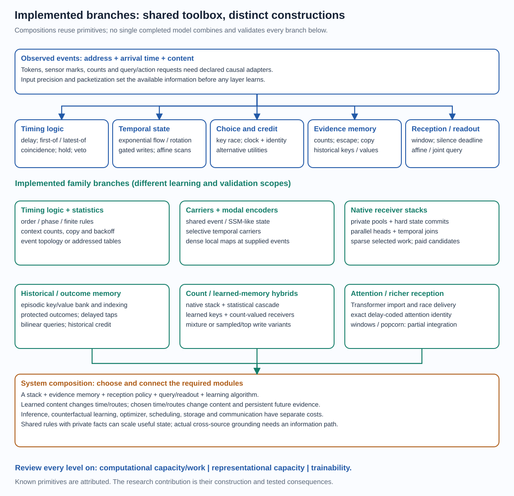

# Whole model family: structures, capacity and learning

4 October 2026. Supporting implementation navigation for the
[generative family definition](model_family_design.md), not the definition itself
or one benchmark recipe.
[Short overview](model_family_overview.md) · [Evidence map](architecture_evidence.md) ·
[Visual atlas](architecture_atlas.html) · [Review](architecture_review.md) ·
[Bounds](../experiments/theory/152_primitives_integration_and_capability_bounds.md)

## Common vocabulary

An **event** is a content-bearing arrival. A **unit** transforms or accumulates
an event and can retain local state. A **module** combines units to implement
a race, filter, memory lookup, pooling operation or timed decision. A **layer**
exposes a declared content/time/state interface. A **stack** composes layers.
A **model composition** can additionally combine a stack with statistical,
historical or outcome memory and a query/readout. A **system** adds data
admission, objectives, credit, optimization, scheduling, execution and storage.
Some legacy code uses these names differently; the interfaces below disambiguate.

## Family branches, reviewed on the same three axes

| Branch / structure | Computational capacity and cost | Representational capacity | Trainability and evidence boundary |
| --- | --- | --- | --- |
| Timing-logic and order detectors: delay, first-of, coincidence, hold, veto; chains and reference timing | Event scheduling and temporal predicates; activity/proposal work can grow with branching | Ordered motifs, intervals, periodic rules and finite logic programs; ideal universality requires precision/storage | Timing/counterfactual or multiplicative route learning; multi-run structured evidence, restricted basis bounds, no general learned-feature theorem |
| Statistical evidence models: conditional tables, backoff, copy traces and expert mixtures | Addressed count updates, context search, lookups, escape/mixture prediction | Sufficient statistics, variable-order contexts, recency and repeated evidence | Count increments need no gradient; mixer/smoothing learn separately. Correct causal E173/E174 evidence; quarantined target-dependent versions excluded |
| Shared addressed event backbone: RaceLayer and SharedEventModel | Segmented memory at supplied events; candidate option maps, hard message schedules and readout | Local/global aggregate evidence, order-dependent timed features, small vector messages | Factual and declared alternative credit; query/observer and pooling semantics affect trainability. Carrier/event experiments have different sparse guarantees |
| Signed modal state encoders: EventStateBlock/Encoder, coalesced and rotating memory variants | Real pairs implement damped complex modes; scans and local nonlinear/residual outputs | Stable exponential filters, phase/order features and nonlinear event representations | Exact supported affine scans plus local clock surrogates; positive encoder evidence and failed depth/phase variants retained |
| Persistent temporal language carriers: Streaming/Parallel/SelectiveEventLanguageModel, prefix-token variants | Every configured carrier layer/map executes per supplied token; state carried according to recipe | Input-conditioned retention/injection, long stream summaries, learned embeddings and temporal modes | Conventional content gradients plus local clock credit; language evidence does not establish sparse selected receiver/value access |
| Native addressed receiver stacks: SparseRaceLanguageModel, ParallelHeadRaceLanguageModel, AddressedEventHeads, NativeStreamLanguageModel | Races over private pools; selected state commits; heads mix/join; standard training computes losing proposals | Deep stateful temporal programs, source-local evidence, independent head channels; source/address choices change information access | Value choice credit improves native language; current full future-write and horizon gaps remain. Best task fits belong here, not to all branches |
| Episodic/historical KV retrieval: Episodic, Indexed, PackedEpisodic and race-language wrappers | Maintain historical key/value bank; candidate index, query matches, winner delivery and losing-value teaching | Content-addressed facts, variable context access, associations beyond a fixed state summary | Learned Q/K/V and local route teacher; index recall, detached historical producers and weight versions limit guarantees. Packed storage is not new expressivity |
| Protected context/outcome memory: ContextAddressed, LateProjected, JointOutcomeRaceQuery, tapped variants | Observed/hash addresses, protected successor writes, retrieval; affine/bilinear or delayed-input readout | Preserves evidence before overwriting; interactions can recover distant relations | Conditional retrieval/decoder credit and late read-time value projection; old producer credit remains truncated. Protected joint task solved without proving useful extra depth |
| Count-carrying native compositions: CountCarrying, CountComposed and gated variants | Native stream plus suffix-count cascade; optional count-message/escape gates | Explicit statistics complement learned context; count-conditioned features expose what the base must complement | Responsibility-weighted base credit can starve; completed small fits/negative results. Offline leave-one-out fitting counts and causal evaluation prefixes differ |
| Statistic-valued learned memory: StatisticRaceNativeModel and Sampled/Top variants | Learned queries/keys; count-valued receivers; dense mixture or sampled/top delivery/write policy per variant | Pools evidence across learned context groups; local statistical predictive distributions | Exact conditional cheap delivery losses/mixtures; writes generally not fully differentiated. Implemented smokes/small fits, not a demonstrated scalable supremacy result |
| Shared-match clock features and repeated arrivals: ClockFeature, RepeatedArrival and historical write eligibility variants | Reuse matches for extra clocks/deliveries; transported responses and caches | Several temporal features or repeated memory reads per match; arrival interactions | Local teachers/eligibilities have stated scopes; modest positive and negative completed screens, no free extra deliveries |
| Transformer import / race wrapper: RaceTransformer | Full projected keys and values; expected, sampled or shortlist delivery, same inherited FFN/residual structure | Preserves reference attention at the properly configured expected/zero-extra-time setting; stochastic alternatives change output | Inherited dense weights and ordinary gradients; this bridge is not an automatically trained native sparse architecture |
| Multi-reception and silence primitives: temporal_window, race_window, relative_race_window, silence_burst | Window moments/expiry, conditional arrivals, timeout deadlines; scheduler and support changes paid | Accumulated evidence, learned reception extent, absence information and burst grouping | Fixed-history/reference contracts; missing integrated scheduler/merge-split/future learning. Not yet the default fitted layer |
| Calibration and growth variants: evolution offsets, bounded scores, split/protected state, identity growth, observer/readout conditioning | Adds controlled degrees of freedom while preserving a specified parent at zero intervention | Separates phase/content/timing, broadens score sensitivity, preserves old functions or exposes readout interactions | Gradient reach, conditioning and finite-step checks do not guarantee held-out improvement; retain failed confirmations |
| Credit and execution variants: exact-pi/factorized races, shadows/replay, cached prefixes, batched/compiled paths, sparse/packed workers | Same or deliberately scoped primal with different gradient estimators, alternative budgets and execution costs | An execution optimization usually preserves expressivity; truncation can preserve state while changing learning reach | Exact source/gradient/recovery contracts required. A complete family is not evidence all optimized paths share gradients or quality |

## Components and interactions

| Level | State / parameters / output | Computational capacity | Representational capacity | Trainability |
| --- | --- | --- | --- | --- |
| Unit | Vector or statistic state; timing/control maps; timed content output | Local transformations, writes, temporal predicates | What one local state and its dynamics distinguish | Direct content/time/state derivatives; discrete support separately credited |
| Module | Receiver pool, candidates, key/value interface, head query | Select a program, retrieve, aggregate or wait | Local conditional functions and accessible evidence | Alternative utility, score conditioning, candidate support and exposure |
| Interaction | Shared memory, head mixing, joins, delayed arrivals, decoder products | One module changes another's input/time/state | Joint features and noncommuting temporal programs | Cross-module paths, cotangent alignment, finite utility and interference |
| Layer | Declared input/output event interface, local persistent state | Parallel heads or sequential event maps with paid joins | New features made available to the next stage | Information preservation, correct reset/jump/order semantics and local Jacobian |
| Stack | Serial layers with persistent state and source-local contexts | Hierarchical selected transformations and recurrence | Conditional sequences of transformations, multi-timescale state | Deep support, Jacobian products, useful depth and credit horizon |
| Composition | Stack + counts, historical retrieval, protected memory, readout | Specialized evidence access plus learned processing | Statistics, abstraction, nonlocal facts and interactions together | Exact responsibilities where available; write/access/producer credit where needed |
| System | Adapter, data, scheduler, objective, optimizer, storage, runtime | End-to-end bounded computation, serving and updates | Capability under actual information, precision, memory and latency | Reproducible complete fits, transfer, online stability and full resource accounting |

An integration is useful only when its information paths actually connect.
For example, separate token and camera source states with shared parameters do
not automatically perform cross-modal factual grounding. A query must access
both observations or an explicitly shared state. Similarly, a count expert
beside a neural predictor does not ensure the neural predictor can inspect the
counts or receives enough learning responsibility to complement them.

## The toolbox's degrees of freedom and their price

| Design choice | Capability or advantage it can provide | What changes or must be paid | Status |
| --- | --- | --- | --- |
| More private state with shared processing maps | More separate facts/streams without relearning every rule independently | More state/key storage, discovery and address exposure; optimizer/key credit remain | Implemented tied/split variants; scoped positive evidence, scaling open |
| More untied receiver programs | Specialization of local computations, retention and output maps | Parameter/optimizer growth and fewer selected examples per program | Implemented; some capacity gains, diminishing gains/overfit retained |
| More selected deliveries or a reception window | Joint evidence, less sampling error and several values per match | Additional value computation/traffic, latency and boundary learning | Repeated-arrival variants implemented; integrated learned-window gap remains |
| Larger training-only alternative budget | More route support and potentially better utility estimates at unchanged hard inference | Candidate values, suffix replay, variance and optimizer work | Exact bounded replay and sampled teachers implemented; benefit not monotone |
| Longer credit horizon | Teach writers/encoders whose benefit arrives much later | More graphs/replays, version consistency and credit variance | Bounded horizon implementations; retention alone does not prove learning reach |
| Wider payload or more modes | More local features and temporal basis functions | Local quadratic maps, traffic and representation exposure | Implemented width/modal sweeps; no fixed universal optimum |
| More layers / identity growth | Composition of reusable local transformations | Extra stage work and deeper state/Jacobian/credit coupling | Useful structured depth; native depth gains and failed deep growth both retained |
| Separate common speed, choice sharpness and clock noise | Control selection distribution, precision and computational time without conflating all three | New parameter sensitivities/clock law; physical bounded-delay and trajectory changes | Factorized/clock-preserving variants; newest normalized-noise native prototype pending |
| Reception-phase offset and alternating parameter updates | Extra degrees of freedom to reduce local route/content update interference | Changes phase semantics/optimizer ownership; shared parameters still couple | Implemented diagnostics/variants; no general solution or consistent advantage established |
| Historical KV or protected outcome bank | Retrieve facts that a compressed recurrent state might lose | Storage/index/search, old value versions, producer credit and read bandwidth | Implemented variants; natural long-range and resource confirmation open |
| Explicit counts and count-conditioned base | Preserve frequent detail cheaply; let learned features focus on generalization | Count memory/lookups, proper causal prediction, responsibility starvation and pooling bias | Implemented compositions; not automatically a better learned representation |
| Affine versus bilinear/polynomial query | Expose relations between retrieved features while leaving the encoder intact | Decoder capacity, conditioning and overfit; missing evidence cannot be invented | Implemented scoped positive/negative probes; not proof every hidden layer learns deeper concepts |
| Sparse candidate index versus full pool | Reduce search with a larger available bank | Index build/update, candidate recall and excluded-route credit | Historical indexes implemented; general learned coverage remains a research gap |
| Packet/coalesced versus individual events | Fewer downstream invocations, exact affine coalescing where closure holds | Information loss unless the full required descriptor is retained; adapter cost | Implemented adapters/scans; nonlinear/routing closure requires separate proof |
| Query-only readout, compilation and persistent packed worker | Avoid unused readouts, dispatch and repeated matrix setup | Snapshot/weight-version and state lifecycle, packing memory and parity contracts | Implemented paths with different admission/measurement status; no expressivity gain claimed |

These choices span **state capacity, parameter capacity, read/write bandwidth,
temporal precision, depth, information preservation and learning effort**.
They should be optimized jointly but measured separately. The most promising
combination is reusable learned rules with private evidence, accurate temporal
programs and economical useful-route credit. That is a testable systems thesis,
not a promise that every knob turned upward improves performance.

## Three kinds of stored knowledge

| Storage | What it represents | How it changes | Characteristic limitation |
| --- | --- | --- | --- |
| Learned parameters | Reusable transformations, compatibility and predictive regularities | Gradient/local parameter updates | Training exposure, optimization and update/version cost |
| Persistent vector / historical state | Current facts, accumulated context, previous keys/values and times | Selected event writes and analytic transport | Retention, access, precision, overwrite and historical credit |
| Explicit statistics | Counts, occupancy, smoothed evidence and sufficient empirical distributions | Causal increments/decay and optional learned pooling | Fixed statistical assumptions, table size and inability to generalize without a learned sharing mechanism |

State adaptation during use is already meaningful even with fixed weights.
Learning new reusable rules during use additionally changes parameters and
requires a stable online credit/update protocol. A large parameter bank, a large
private-state bank and a large historical datastore are different forms of
capacity; comparisons must report them separately.

## Mechanism coverage is not cumulative across papers or results

| Construction | Hard chosen content / state | Temporal content evolution | Historical KV | Explicit counts | Multi-reception / silence | Important limit |
| --- | --- | --- | --- | --- | --- | --- |
| Pure timing logic | Logic-selected events | Scalar timing/logic | Not required | Not required | Holds/coincidence/reference rules | Restricted motif priors and timing precision |
| Causal statistics | Prediction mixture/race, addressed increments | Some recency/decay variants | Copy/statistical memory, not learned KV by default | Yes | Not the native burst scheduler | Does not prove learned deep abstractions |
| Temporal carrier | Clock choice; content may be shared | Yes | No by default | No by default | No by default | Dense carrier work per supplied event |
| Native receiver stack | Selected content and private commit | Yes | No per-position bank by default | No by default | Winner-only by default | All-key/proposal training; incomplete future-write utility |
| Native episodic variant | Selected receivers and retrieved values | Yes | Yes | No by default | Repeated deliveries only in explicit variants | Historical producer/cache/coverage limits |
| Count/statistic-native composition | Core hard commits; extra mixture/write policies vary | Yes in core | Counts or addressed evidence, not automatically KV | Yes | No default burst scheduling | Exact local count credit is not complete future credit |
| Delay-coded attention construction | Aggregates delivered support | Exponential transport | Attention keys/values | Count normalization channel, not an n-gram table | All retained deliveries | Exact identity pays comparison/delivery/latency/ratio |
| Window/popcorn reference | Chosen reception/timeout semantics | Declared local flow | Optional future integration | Optional future integration | Yes | Reference is not a completed native composed learner |

There is no completed model here that simultaneously validates every mechanism,
all domains, scalable learning, quality-matched serving and hardware energy.
The family nevertheless offers explicit finite constructions and several
distinct tested footholds rather than one isolated experimental structure.

## Learning variants belong in the model description

The same hard forward choices can have different training semantics:
pathwise winner-only derivatives; centered local message teachers; exact-pi
linear teachers; factorized clock/choice estimators; paired full continuation
returns; sampled alternatives; hypothetical state-write auxiliaries; detached
historical eligibility; auxiliary readouts; and chunk-truncated credit.
The loss, condition being averaged, causal state, proposal support and gradient
scope must accompany the architecture name. Conservation, norm balance or an
unbiased *local* estimator does not certify the complete task update.

For stateful deployment, document whether weights are frozen, state updates
continue, statistics increment, a query resets state, and old cached activations
were produced under a different weight version. Online state adaptation is
distinct from online parameter learning. Current optimizer/clip/compiled
recipes do not demonstrate asynchronous on-chip learning.

## Task recipes instantiate the family; they do not define it

| Representative recipe | Input/readout/state boundary | Relevant family member |
| --- | --- | --- |
| Segment-batched text8 | One-hot characters, one source, next-symbol loss; cold independent training segments; reset overlapping evaluation windows | Native receiver stack with recipe-specific value credit |
| Streaming language replay | Causal token stream, carried state; truncated entering-state graph and declared return horizon | Native stack with actual bounded continuation credit |
| Primate decoding | Binned neural spike vectors, velocity readout; reset fitting windows and fresh persistent evaluation stream; optional sampled-stream averaging/smoothing | Native receiver stack, tied or untied maps |
| Mackey–Glass | Fixed causal taps, next-value or increment loss; teacher-forced fit and autonomous forecast | Native receiver stack; sampling/clock precision exposed |
| Speech/gesture | Declared packets or raw-event encoders, terminal/prefix/pooled readout; source/group/time resolution must be preserved | Several encoder/native branches with different information boundaries |
| Protected relation / associative recall | Explicit causal evidence bank, query cue and interaction readout | Retrieval/protected-outcome composition; task priors explicit |

References: [language recipe](../experiments/language_batched_benchmark.py),
[primate](../experiments/primate_reaching_native.py),
[forecasting](../experiments/mackey_glass_native.py),
[raw-count speech recipe](../experiments/shd_native.py),
[information-preserving speech admission](../experiments/public_speech_packets.py).
The two speech adapters are different; neither should silently inherit the
other's causal/timing/information guarantees.

## Source map

The generated [source inventory](architecture_source_inventory.json) lists
every current `sleeping_machines` module, its classes/bases, top-level functions,
docstring summary and source hash, plus representative foundational experiment
drivers. It uses AST parsing only. This is a navigation/coverage aid, not
runtime introspection, a claim of validated quality for every file, or a catalog
of every historical experimental result. The semantic branch review above is
the architectural explanation. New modules require review, not automatic
promotion from an imported class to an established capability.

Established primitives and useful precedents are attributed in the review.
The candidate research contribution is their temporal/stateful/sparse-credit
composition and the demonstrated consequences. The remaining decisive question
is scalable useful learning and total resource advantage, not class-name count.
