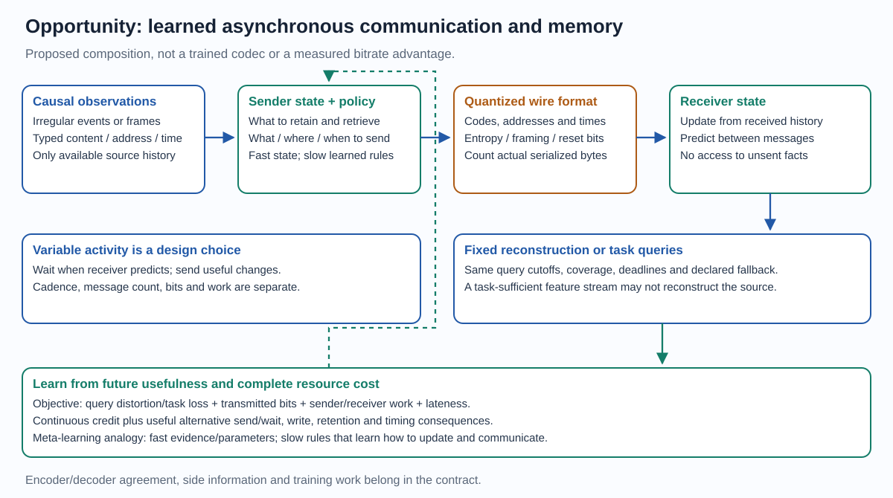

# Opportunities opened by the model family

4 October 2026 · Private research and product hypotheses.

[Family overview](model_family_overview.md) · [Formal core](model_family_specification.md) ·
[Design space](model_family_design.md) · [Evidence](architecture_evidence.md)

Sleeping Machines aims to be the next general-purpose substrate for machine intelligence: one trainable architecture, learning rule and execution model spanning language and reasoning, multimodal world models, embodiment, event-native analytics, continual learning, communication, self-design and datacenter, edge and clockless hardware.

Input, internal computation, memory, learning and output can all be event-driven.
Different regions can also use dense operations or synchronous barriers. Each
opportunity below identifies its mechanism, current evidence and first decisive
test.

## Opportunity map

| ID / opportunity | Why this family fits | Current status | First discriminating proof |
| --- | --- | --- | --- |
| O1 / Irregular and variable-rate inputs | Addressed observations update persistent programs at their own times; silence and timing remain usable | Native event/state mechanisms implemented; next: joint mixed-source training | Same causal observations and queries versus timestamp-aware controls; quality, work, latency and burst capacity |
| O2 / Adaptive asynchronous neural codecs | Learned messages can become quantized communications; send/wait and local state can allocate rate over time and space | Proposed application; no completed codec or rate-distortion result | Causal independently decodable stream; actual bytes versus reconstruction error, work and latency |
| O3 / Task-oriented distributed communication | Send the evidence a remote predictor needs, using persistent receiver context | Proposed composition; next: train sender and receiver jointly | Same downstream task quality using fewer transmitted bits after metadata and decoder work |
| O4 / Learning memory and scheduling policies | Slow learned rules govern fast writes, retention, retrieval, timing and optional computation | Relevant meta-learning precedents; local choice-credit and an earlier online pilot provide scoped project evidence | Delayed-use tasks with randomized facts and held-out task variations; compare future-return credit with immediate utility |
| O5 / Joint embodied and cognitive learning | Language, vision, touch, proprioception and actions can share state, parameters and learning paths despite different cadences | Integration design; next: joint manipulation/reasoning training and transfer tests | Joint manipulation/reasoning model improves held-out cognitive tasks from motor training, with data/compute-matched ablations |
| O6 / Persistent inference and computing substrates | Available state/program capacity can exceed selected activity; local work and communication may suit datacenter and edge deployments | Language and mechanism results; next: trained sparse parity and complete serving-cost measurement | Repeated comparable-quality inference with complete traffic, residency, throughput, latency and energy accounting |

Input cadence, message count, encoded bit rate, selected computation and physical
clocking are separate axes. None automatically scales with another. A single
large event may cost more bits or work than many small events. A sparse output
can still be produced by expensive candidate discovery or learning.

## O1. Direct irregular-stream ingestion

Admit observations as typed content/address/time events. A shared world state
can integrate independent sources without first forcing every source onto one
periodic sample grid. Required schemas, decoding and feature extraction remain
explicit. Arbitrary compressed bytes require a compatible decoder or a learned
representation of their format; variable bit rate alone is not a semantic API.

The potential gain is retaining useful temporal detail and recruiting only the
programs needed by an arrival, timer or query. Idle intervals can avoid periodic
recomputation when the selected dynamics permit it. Analytic flow, timers,
mandatory queries, discovery and burst handling still cost resources.

Dense local arithmetic does not inherently require synchronous dense input.
[Neural CDEs](https://arxiv.org/abs/2005.08926) address irregular time series;
[EventSSM](https://arxiv.org/abs/2404.18508) processes event streams directly;
[AEGNN](https://openaccess.thecvf.com/content/CVPR2022/html/Schaefer_AEGNN_Asynchronous_Event-Based_Graph_Neural_Networks_CVPR_2022_paper.html)
updates affected graph activations asynchronously. They are relevant controls.
Our opportunity is useful temporal/state/routing/credit integration across the
whole model. Test event-based sensing, irregular telemetry and mixed-source
robotics without assuming that a framing baseline is the strongest alternative.

## O2. Variable-rate asynchronous neural codecs

A sender observes the causal source history and maintains encoder state. It
chooses whether, where and when to communicate a quantized message. The decoder
updates from the received stream and its own state, answering reconstruction
queries under an agreed cutoff/deadline. Quiet or predictable regions may need
fewer messages; surprising changes may recruit more. Dense source frames and
dense output reconstructions can coexist with selective latent communication.

The existing internal message interface is a useful construction starting
point, but floating-point internal messages are not already a compressed codec.
Declare quantization, entropy coding, framing, addresses, time resolution,
initialization/reset, model versions and decoder-available context. Encoder
decisions must use observed history; the receiver cannot access unsent source
facts, unshared randomness or training-only state. Receiver adaptation must be
reproducible from its allowed history or transmitted as side information.

For transmitted stream M, count B=|Serialize(M)|, including all side information
and padding. Timing conveyed by a physical channel also consumes a specified
timing/bandwidth resource; it is not a free unbounded-precision code. Report bits
per source second for temporal streams, or bits per pixel/sample for their stated
denominator. Internal simulated delay is not measured transport latency.

A suitable declared objective is

    J = E[sum over fixed queries q of w_q * distortion(x_q, decoded_q)
          + lambda * transmitted_bits
          + mu * (encoder_work + decoder_work)
          + nu * declared_lateness_penalty].

The coefficients specify a tradeoff, not a predicted advantage. Query coverage,
fallbacks and causal latency stay fixed by protocol. Count full training work,
including alternative replays and optimizer, separately from deployment work.
For a task-specific feature codec, replace or supplement distortion with the
downstream task loss and label the changed objective.

Variable-rate neural compression has precedents:
[progressive recurrent codecs](https://arxiv.org/abs/1511.06085) and
[conditional autoencoders](https://arxiv.org/abs/1909.04802). Recent
[Neural Events](https://arxiv.org/abs/2606.19835) also learns asynchronous discrete
event representations, reporting event-rate reduction for recognition tasks.
Event counts and those task results are not measured bitstream rate-distortion
comparisons. The proposed distinctive combination is learned event scheduling,
content, persistent prediction and selective computation with complete credit.

First establish a small quantized wire/decoder contract and query semantics;
then test one causal stream against matched predictive, neural and event-based
controls over a rate-distortion-work-latency curve. Include quiet intervals,
bursts and unexpected changes. No codec benchmark is queued by this document.

## O3. Communications that preserve task-relevant evidence

An edge unit could maintain local state and send selected latent updates to a
remote shared model, or a multi-device system could communicate updates between
state owners. The hypothesis is reduced traffic with useful persistent context
at the receiver. Task-aware feature compression already has precedents, such as
[supervised edge compression](https://openaccess.thecvf.com/content/WACV2022/html/Matsubara_Supervised_Compression_for_Resource-Constrained_Edge_Computing_Systems_WACV_2022_paper.html).
Our test concerns learned timing and selective stateful interaction as well.

Specify receiver synchronization, reset/recovery, delivery/order behavior,
adaptation/version agreement and the query objective. Losing reconstruction
detail is acceptable only under the declared task contract. Measure actual
transmissions and both endpoints' work. This is adjacent to O2 but does not
claim faithful general-purpose reconstruction from task-sufficient features.

## O4. Meta-learning supplies memory-policy mechanisms

The useful mapping is **fast state and slow learned rules**. Within a stream,
fast state can contain private facts, addresses, clocks, eligibility or fast
parameters. Across training histories/tasks, slow parameters learn the update,
retention, retrieval and scheduling rules that make later predictions better:

    a_t ~ policy_theta(allowed_history, m_t)
    m_(t+1) = Update_theta(m_t, observed_event_t, a_t)
    outer objective = expected future query loss + declared resource cost.

For a smooth fixed event history, differentiate through the memory evolution.
For hard writes, send/wait or changed reception membership, use a declared
discrete consequence estimator or finite alternative replay in addition to
continuous sensitivities. A generic learned state-update map does not require
a separate MAML-style algorithm or second derivatives. A gradient-based inner
learner may introduce such derivatives through its specified update rule.

[Memory-augmented meta-learning](https://proceedings.mlr.press/v48/santoro16.html),
[DNC learned memory use/allocation](https://www.nature.com/articles/nature20101),
[learned optimizers](https://arxiv.org/abs/1606.04474) and
[TTT layers](https://arxiv.org/abs/2407.04620) provide relevant mechanisms.
Their results support the analogy; they do not establish our sparse temporal
learner's performance. Ordinary recurrent memory learning becomes a testable
meta-learning claim when the learned adaptation policy transfers across the
declared new histories/tasks. Joint asynchronous credit and producing versions
remain part of our implementation contract.

Prefer bounded delayed-use tests that defeat trivial fact memorization: change
symbol-to-value assignments across episodes; require later retrieval, overwrite
or retention; hold out delay, arrival-order and task variations. Compare useful
memory without credit, immediate value credit, and complete affordable future
returns. Reuse successful integrated parents; do not displace owned queues.

## O5. Embodied skills informing cognition

The architectural promise is shared causal state and trainable information
paths between sensing, contact, actions, language and reasoning. Motor outcomes
could teach reusable representations of persistence, geometry, intervention,
uncertainty and planning. Conversely, language objectives could guide useful
perception and action. These transfers are hypotheses about learned structure;
they do not follow simply from putting tasks in the same event graph.

Present VLA systems already explore this integration:
[PaLM-E](https://arxiv.org/abs/2303.03378),
[RT-2](https://arxiv.org/abs/2307.15818) and
[pi0.5](https://arxiv.org/abs/2504.16054). Their joint training and reported
generalization invalidate a blanket claim that conventional models cannot
connect embodied and cognitive learning. Separate controller/LLM modules can
also transfer knowledge through joint training, shared features or distillation.
We seek a finer temporal/state/action integration and favorable full resource
behavior, with typed physical interfaces retained.

End-to-end training means the objectives can teach the relevant model paths.
It does not require differentiating through the physical world: demonstrations,
learned dynamics or properly credited rewards can provide supervision. A sparse
graph must still deliver useful credit across hard routes and long delays.
Actuator limits, causal availability and real-time query/action deadlines belong
to the specified task rather than disappearing with clockless semantics.

Test **both directions of transfer separately**. To establish motor-to-cognitive
transfer, add motor experience and improve a held-out cognitive task with equal
data/compute accounting against no-motor, disconnected-state and stopped-credit
controls. Reverse transfer needs its own comparison. Test unseen objects,
compositions, embodiments and timing variations. Preserve general skills and
measure negative transfer as well. Begin with bounded simulated interactions;
physical dexterity and broad generalism require separate evidence.

AGI is an overarching aspiration. A general event/state substrate can remove
some interface restrictions and support broader training. Neither universality,
asynchrony nor cross-task transfer defines or proves AGI. State the capability
distribution, learning/adaptation and resource criteria before claiming progress.

## Keeping this register useful

Promote each opportunity through: architectural hypothesis → specified
composition/protocol → validated implementation → completed repeated quality
and full-resource comparison → deployment/demand evidence. Link actual result
records at promotion; preserve failures and revise the hypothesis beside them.
Scope an advantage to its task and resource boundary. No current codec,
embodied transfer, AGI or customer-interest claim is created by this register.

Several opportunities share one learning/runtime bottleneck and are correlated.
Their addressable markets cannot simply be summed into a valuation. Prioritize
reusable mechanisms and one discriminating proof at a time. Existing integrated
research queues retain priority; this document authorizes no training launch,
hardware expenditure, physical robot operation or external disclosure.
